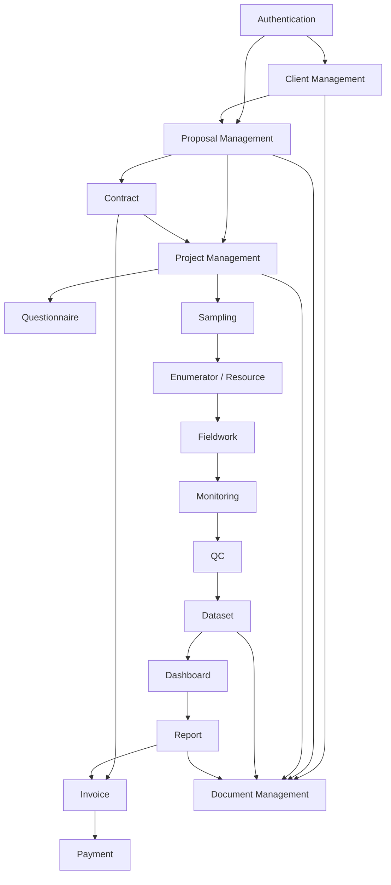

# MVP Milestone Review v1

Tanggal:
26 Juli 2026

Status:
Draft untuk Product Owner Review

## 1. Modul yang sudah selesai

### Foundation

- Struktur repository ResearchAI.
- Dokumentasi awal project.
- Technology Stack Decision.
- System Architecture.
- Development Setup Guide.
- Backend Basic Setup.
- Database Connection.
- Authentication Basic.
- Frontend Basic Setup.

### Client Management

- Client List.
- Client Detail atau Client 360.
- Client Contact Management.
- Multi Contact Person.
- Primary Contact.
- Decision Maker.
- Validasi email dan nomor HP.
- Activity Timeline pada Client 360.
- Lokalisasi Client Management ke Bahasa Indonesia.

### Proposal Management

- Proposal Workflow MVP v0.1.
- Proposal Backend MVP Upgrade.
- Proposal Number otomatis.
- Proposal Owner otomatis.
- Proposal activity logging dari backend.
- Proposal List.
- Proposal Detail read-only.
- Proposal Status Actions.
- Relasi Proposal ke Client 360.

### Documentation dan Product Governance

- ResearchAI Domain Model v1.0.
- ResearchAI Domain Model v1.1.
- Proposal Workflow MVP.
- Sprint Summary Sprint 2, Sprint 3, dan Sprint 4.
- Backlog AUTH-001, UI-001, UI-002, dan UI-003.

## 2. Modul yang sedang berjalan

### Proposal Management

Proposal Management masih berjalan.

Yang sudah tersedia:

- List.
- Detail.
- Status Actions.
- Backend workflow.
- Activity logging.

Yang belum tersedia:

- Create Proposal Form.
- Edit Proposal Form.
- Proposal timeline khusus.
- Proposal activity section khusus di detail.
- Dokumen proposal atau attachment.

### Client 360

Client 360 sudah menjadi pusat informasi client, tetapi masih dapat diperkuat.

Yang sudah tersedia:

- Overview.
- Contacts.
- Activities.
- Proposals.
- Placeholder Projects.
- Placeholder Documents.

Yang belum tersedia:

- Project aktual.
- Invoice aktual.
- Revenue aktual dari Contract atau Invoice.
- Document Management lintas domain.

## 3. Modul yang belum dimulai

### CRM dan Business Development lanjutan

- Lead.
- Opportunity.
- Quotation.
- Contract.

### Project Management

- Project.
- Questionnaire.
- Sampling.
- Enumerator.
- Fieldwork.
- Monitoring.
- QC.

### Data

- Dataset.
- Dashboard.
- Report Generator.

### Finance

- Invoice.
- Payment.

### Administration

- Team.
- Notification.
- Calendar.
- Task.
- Role management lanjutan.

### AI

- AI Assistant.
- Insight Generator.
- AI Report Generator.
- Data Quality Checker.
- AI Knowledge Base.

### Knowledge Management

- Template Library.
- Questionnaire Library.
- Report Library.
- Methodology Library.
- Research Repository.
- Best Practice.

### Resource dan Vendor Management

- Enumerator Management.
- Supervisor.
- QC.
- Moderator.
- Caller.
- Vendor.
- Partner.
- Outsourcing.
- Rental.
- Printing.
- Courier.

### Document dan Asset Management

- Attachment lintas domain.
- Asset Management untuk tablet, laptop, smartphone, modem, printer, dan SIM card.

## 4. Dependency antar modul

Dependency utama:

- Proposal membutuhkan Client.
- Project sebaiknya dibuat setelah Proposal Approved.
- Contract sebaiknya mengikat Proposal Approved sebelum Project atau Invoice.
- Invoice membutuhkan Contract atau Project yang jelas.
- Dataset membutuhkan Project, Fieldwork, dan QC.
- Report membutuhkan Dataset dan Dashboard.
- Document Management sebaiknya menjadi cross-domain service.
- Activity Timeline harus tetap menjadi cross-cutting behavior setiap modul.

## 5. Gap Analysis

### Gap Produk

- Proposal belum bisa dibuat dari frontend.
- Proposal belum bisa diedit dari frontend.
- Project belum tersedia, padahal Proposal Approved sudah siap Project Setup.
- Contract belum tersedia, sehingga nilai kontrak masih berbasis estimated budget.
- Invoice dan Payment belum tersedia.
- Document Management belum tersedia.
- Timeline proposal detail belum tersedia.

### Gap Operasional

- Belum ada alur Lead dan Opportunity sebelum Client atau Proposal.
- Belum ada role dan permission granular.
- Belum ada workflow internal approval.
- Belum ada modul task atau calendar untuk follow-up.

### Gap Data

- Belum ada dataset lifecycle.
- Belum ada dashboard analitik.
- Belum ada report generator.
- Belum ada data quality workflow.

### Gap Arsitektur

- Migration masih menggunakan script sederhana, belum migration framework formal seperti Alembic.
- Frontend helper untuk status proposal masih terduplikasi dan dapat dirapikan nanti.
- Error handling login backend down sudah menjadi backlog AUTH-001.
- Document attachment perlu desain cross-domain sebelum dibuat.

## 6. Prioritas MVP berikutnya

Prioritas MVP sebaiknya tetap mengikuti alur bisnis inti:

Client -> Proposal -> Project -> Fieldwork -> Dataset -> Report -> Invoice

Prioritas terdekat:

1. Selesaikan Proposal Management agar bisa create dan edit dari frontend.
2. Buat Project Setup dari Proposal Approved.
3. Buat Project Management basic.
4. Buat Document Management basic untuk Proposal dan Project.
5. Mulai Fieldwork atau Dataset hanya setelah Project basic stabil.

## 7. Rekomendasi urutan Sprint 5-10

### Sprint 5

Proposal Form - Create Proposal

Tujuan:
Business Development dapat membuat proposal draft dari frontend dalam waktu kurang dari 3 menit.

Scope:

- Tombol `+ Proposal Baru` aktif.
- Form awal:
  - Client
  - Proposal Title
  - Research Type
  - Estimated Budget
- Proposal Number dan Owner tetap otomatis dari backend.
- Activity `Proposal dibuat` tercatat dari backend.

### Sprint 6

Proposal Form - Edit Proposal

Tujuan:
Business Development dapat melengkapi proposal setelah draft dibuat.

Scope:

- Edit proposal tanpa mengubah status.
- Field lanjutan:
  - Objective Riset
  - Ringkasan Metodologi
  - Estimasi Timeline
  - Estimated Budget
- Activity `Proposal diperbarui` tercatat dari backend.

### Sprint 7

Proposal Timeline dan Activity Refinement

Tujuan:
Membuat riwayat proposal lebih mudah dibaca.

Scope:

- Timeline Proposal di Proposal Detail.
- Activity Proposal yang terkait proposal tertentu.
- Penyelarasan label activity Bahasa Indonesia.

### Sprint 8

Project Setup Planning dan Design Review

Tujuan:
Menentukan desain Project Management sebelum coding.

Scope:

- Review Domain Model v1.1.
- Definisi entity Project MVP.
- Relationship Proposal Approved -> Project.
- Workflow Project MVP.
- Wireframe Project List dan Project Detail.

### Sprint 9

Project Management Backend Basic

Tujuan:
Menyiapkan backend Project agar Proposal Approved dapat masuk Project Setup.

Scope:

- Schema Project MVP.
- Endpoint Project basic.
- Relasi ke Client dan Proposal.
- Activity logging Project.
- Tidak membuat Fieldwork dulu.

### Sprint 10

Project Management Frontend Basic

Tujuan:
Membuat Project List dan Project Detail basic.

Scope:

- Project List.
- Project Detail.
- Link dari Proposal Approved ke Project Setup.
- Link Project ke Client 360.
- Placeholder Questionnaire, Sampling, Fieldwork, Dataset, Report, Invoice.

## 8. Risiko

### Risiko Scope Creep

Proposal Management bisa melebar ke Quotation, Contract, dan Project terlalu cepat.

Mitigasi:
Tetap selesaikan create/edit proposal lebih dulu sebelum membuat Project.

### Risiko Arsitektur

Jika Project dibuat tanpa desain matang, modul berikutnya seperti Questionnaire, Sampling, Fieldwork, dan Dataset bisa terikat desain yang kurang tepat.

Mitigasi:
Sprint 8 harus berupa planning dan design review Project sebelum coding.

### Risiko Data dan Audit Trail

Jika activity logging tidak konsisten sejak awal, Client 360 kehilangan nilai sebagai pusat riwayat.

Mitigasi:
Setiap sprint modul bisnis wajib memasukkan activity logging sebagai acceptance criteria.

### Risiko UX

Terlalu banyak action pada Proposal Detail bisa membuat user bingung.

Mitigasi:
Gunakan Next Business Action, bukan dropdown bebas.

### Risiko Technical Debt

Migration script sederhana cukup untuk MVP awal, tetapi akan makin sulit saat schema kompleks.

Mitigasi:
Evaluasi migration framework sebelum Project dan Finance berkembang.

## 9. Rekomendasi Product Development

1. Jangan masuk Project Management sebelum Proposal Form Create dan Edit selesai.
2. Pertahankan pola Design Review sebelum implementasi.
3. Jadikan Activity sebagai acceptance criteria tetap untuk setiap modul bisnis.
4. Prioritaskan alur operasional yang menghasilkan nilai bisnis cepat:
   Client -> Proposal -> Project.
5. Tunda AI sampai Knowledge Management dan data operasional cukup matang.
6. Tunda Quotation dan Contract sampai Project basic jelas.
7. Tunda Invoice sampai Contract atau Project value sudah lebih stabil.
8. Mulai rapikan arsitektur migration sebelum modul Project dan Finance semakin kompleks.
