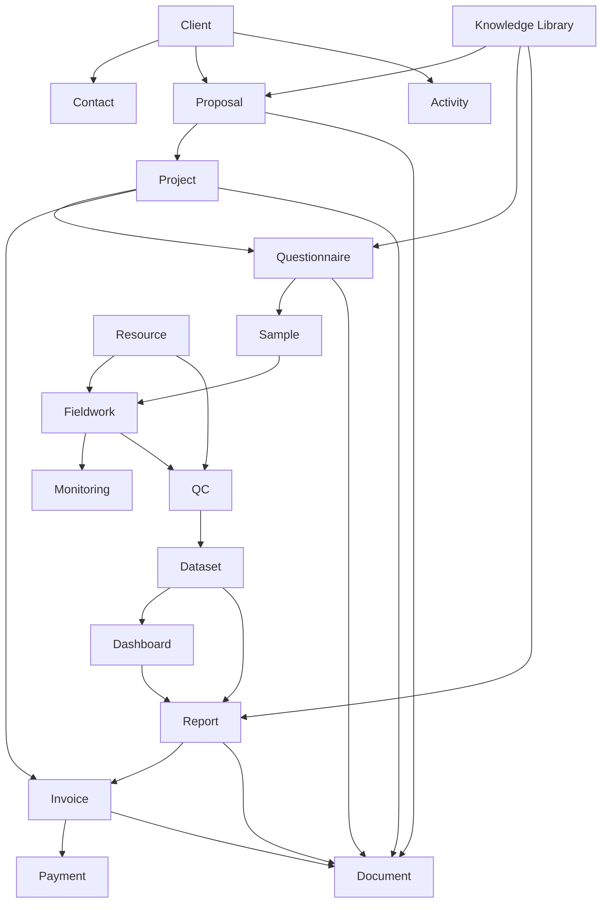

# Module Dependency v2

Tanggal:
26 Juli 2026

Scope:
ResearchAI MVP setelah Sprint 7

## 1. Dependency Principle

ResearchAI harus dibangun berdasarkan dependency bisnis, bukan hanya urutan UI.

Dependency utama:

```text
Client
  -> Proposal
  -> Project
  -> Questionnaire
  -> Sample
  -> Fieldwork
  -> Monitoring
  -> QC
  -> Dataset
  -> Dashboard
  -> Report
  -> Invoice
  -> Payment
```

Jika dependency ini dilompati, modul berikutnya berisiko salah desain.

## 2. Current Implemented Dependency

Sudah tersedia:

```text
Client
  -> Proposal
  -> Project
  -> Questionnaire
```

Detail:

- Client memiliki Proposal.
- Proposal Approved dapat menghasilkan Project.
- Project memiliki banyak Questionnaire.
- Questionnaire dibedakan berdasarkan Target Respondent.

## 3. Dependency Map



## 4. Module Dependency Table

| Module | Depends On | Dependent Modules | Notes |
| --- | --- | --- | --- |
| Client | User/Auth | Proposal, Project, Invoice, Activity | Relationship center |
| Contact | Client | Proposal contact integration, Activity | Multiple contacts supported |
| Proposal | Client, User | Project, Invoice reference, Activity | Business document |
| Project | Proposal Approved, Client | Questionnaire, Sample, Fieldwork, Report, Invoice | Operational root |
| Questionnaire | Project | Sample, Fieldwork, QC | Multiple per Project |
| Sample | Project, Questionnaire | Fieldwork, Monitoring | Should likely be tied to Target Respondent |
| Fieldwork | Project, Questionnaire, Sample | Monitoring, QC, Dataset | Execution layer |
| Resource | User/Role, Project | Fieldwork, QC | Enumerator, Supervisor, QC |
| Monitoring | Fieldwork, Sample | Project dashboard, Management overview | Progress tracking |
| QC | Fieldwork, Dataset draft | Dataset Ready, Report | Quality gate |
| Dataset | QC, Fieldwork | Dashboard, Report, AI Insight | Data foundation |
| Dashboard | Dataset | Report, Operating Dashboard | Summary/visual output |
| Report | Dataset, Dashboard, Project | Invoice, Knowledge Repository | Client deliverable |
| Document | Source domain | AI/Knowledge, Audit | Cross-domain attachment |
| Invoice | Client, Project, Report | Payment, Finance Dashboard | Revenue record |
| Payment | Invoice | Finance closure | Business cycle closure |
| Knowledge Library | Proposal, Questionnaire, Report | AI, Reuse | Can start as metadata |
| Activity | All business modules | Client Timeline, Project Timeline | Cross-cutting behavior |

## 5. Prerequisite Groups

### Group A - Already Available

- Client.
- Contact.
- Proposal.
- Project.
- Questionnaire.
- Activity basic.

### Group B - Must Come Next

- Technical Foundation minimal.
- Sample.

Reason:

Sample is the bridge between Questionnaire and Fieldwork.

### Group C - Execution Layer

- Fieldwork.
- Resource.
- Monitoring.

Reason:

Fieldwork cannot be useful without sample target and basic resource concept.

### Group D - Quality and Data Layer

- QC.
- Dataset.

Reason:

Dataset should not become final before QC.

### Group E - Delivery Layer

- Dashboard.
- Report.
- Document.

Reason:

Report needs data and/or dashboard output.

### Group F - Finance Layer

- Invoice.
- Payment.

Reason:

Invoice should connect to Project/Report delivery.

### Group G - Reuse and Management Layer

- Knowledge Library.
- Operating Dashboard.
- MVP Hardening.

Reason:

Knowledge and management overview become meaningful after enough workflow data exists.

## 6. Critical Dependencies

### Questionnaire -> Sample

Question:

Apakah setiap Questionnaire memiliki Sample sendiri?

Recommended answer:

For MVP, Sample should support Target Respondent and may reference Questionnaire.

Reason:

Project multi-questionnaire seperti STKU membutuhkan sample berbeda per target respondent.

### Sample -> Fieldwork

Fieldwork progress should be measured against Sample target.

Without Sample:

- Completion rate tidak jelas.
- Quota tidak jelas.
- Monitoring tidak bermakna.

### Fieldwork -> QC

QC should review output from Fieldwork.

Without Fieldwork:

- QC hanya menjadi checklist manual tanpa source.

### QC -> Dataset

Dataset Ready should depend on QC completion.

Without QC:

- Data bisa dianggap final terlalu awal.

### Report -> Invoice

Invoice can be created from Project, but delivery-based invoicing should reference Report or milestone.

For MVP:

- Invoice may be created from Project.
- Report reference can be optional.

## 7. Parallelizable Modules

Modules that can be designed in parallel:

- Document Basic and Report Foundation.
- Knowledge Library and Report Foundation.
- Resource Basic and Fieldwork Discovery.
- Dashboard Basic and Dataset Foundation.

Modules that should not be implemented before dependencies:

- Fieldwork before Sample.
- Dataset before QC.
- Payment before Invoice.
- AI Insight before Dataset.
- Advanced Dashboard before Dataset.

## 8. Dependency Risks

### Risk 1 - Sample Delayed

Impact:

Fieldwork becomes vague and hard to measure.

Priority:
High

### Risk 2 - Resource Delayed

Impact:

Fieldwork can exist only as project-level progress, not operational assignment.

Priority:
Medium

### Risk 3 - QC Delayed

Impact:

Dataset quality is not controlled.

Priority:
High

### Risk 4 - Document Delayed

Impact:

Proposal, questionnaire, report, and invoice files remain scattered.

Priority:
Medium

### Risk 5 - RBAC Delayed

Impact:

Multi-role operation will be unsafe.

Priority:
High before production.

## 9. Recommended Build Order

Recommended:

```text
1. Technical Foundation minimal
2. Sample Discovery
3. Sample Foundation
4. Fieldwork Discovery
5. Fieldwork Foundation
6. Resource Basic
7. Monitoring MVP
8. QC Foundation
9. Dataset Foundation
10. Dashboard Basic
11. Report Foundation
12. Document Basic
13. Invoice Foundation
14. Payment Tracking
15. Knowledge Library Basic
16. Operating Dashboard
17. MVP Hardening
```

## 10. Sprint Dependency View

| Sprint | Module | Must Have Before | Unlocks |
| --- | --- | --- | --- |
| 8A | Technical Foundation Planning | Sprint 7 | Safer architecture |
| 8B | Migration Baseline | 8A | Safe schema changes |
| 8C | Integration Test Baseline | 8A | Safer refactoring |
| 8 | Sample Discovery | Questionnaire | Sample implementation |
| 9 | Sample Backend | Sample Discovery | Sample Frontend |
| 10 | Sample Frontend | Sample Backend | Fieldwork Discovery |
| 11 | Fieldwork Discovery | Sample | Fieldwork Backend |
| 12 | Fieldwork Backend | Fieldwork Discovery | Fieldwork Frontend |
| 13 | Fieldwork Frontend | Fieldwork Backend | Monitoring |
| 14 | Resource Basic | Fieldwork Discovery | Assignment |
| 15 | Monitoring MVP | Fieldwork, Sample | QC visibility |
| 16 | QC Foundation | Fieldwork | Dataset |
| 17 | Dataset Foundation | QC | Dashboard, Report |
| 18 | Dashboard Basic | Dataset | Report support |
| 19 | Report Foundation | Dataset, Dashboard | Invoice trigger |
| 20 | Document Basic | Core domains | Attachments |
| 21 | Invoice Foundation | Project, Report | Payment |
| 22 | Payment Tracking | Invoice | Finance closure |
| 23 | Knowledge Library Basic | Proposal, Questionnaire, Report | AI/reuse |
| 24 | Operating Dashboard | Core workflow data | MVP management view |
| 25 | MVP Hardening | All MVP modules | MVP Release |

## 11. Final Recommendation

ResearchAI should not jump directly from Questionnaire to Fieldwork.

The correct next domain step is:

```text
Sample
```

But before Sample implementation, one minimal technical foundation sprint is recommended to reduce risk.

Recommended next sequence:

```text
Sprint 8A - Technical Foundation Planning
Sprint 8B - Migration Baseline
Sprint 8C - Integration Test Baseline
Sprint 8  - Sample Discovery
```
