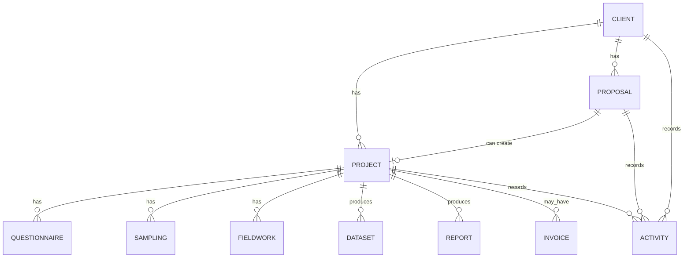
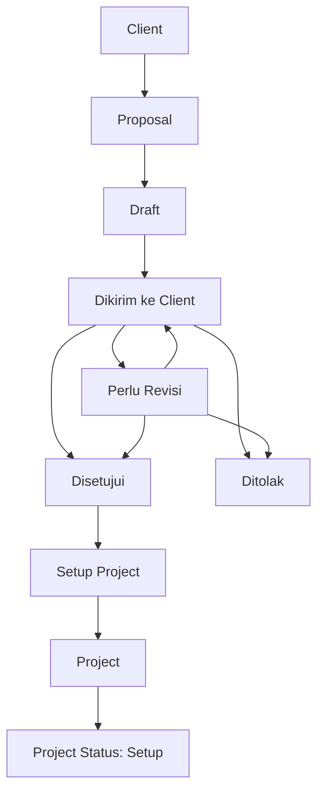
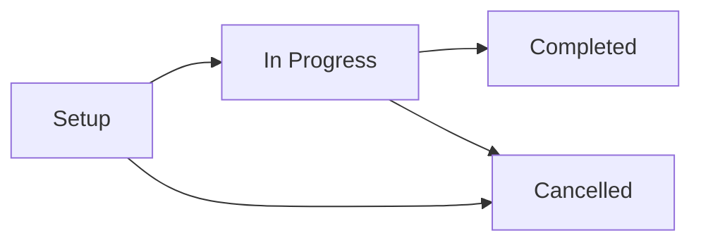

# Project Discovery v1

Status:
Draft untuk Product Owner Review

Tanggal:
26 Juli 2026

Scope:
Architecture Discovery untuk hubungan Client, Proposal, dan Project.

Catatan:
Dokumen ini bukan implementasi. Tidak ada perubahan kode, database, maupun API.

---

# 1. Executive Summary

Project adalah delivery center ResearchAI.

Proposal berada di domain Business Development, sedangkan Project berada di domain Project Management. Proposal yang disetujui client menjadi dasar untuk Project Setup, tetapi Project bukan sekadar perubahan status Proposal.

Rekomendasi arsitektur untuk MVP:

- Project dibuat setelah Proposal berstatus `Approved`.
- Project dibuat melalui action eksplisit, bukan otomatis.
- Satu Proposal menghasilkan maksimal satu Project pada MVP.
- Project wajib memiliki Client.
- Project mewarisi sebagian data Proposal sebagai default awal.
- Proposal tetap menjadi historical record business development.
- Project memulai lifecycle baru untuk delivery riset.

---

# 2. Domain Analysis

## 2.1 Client

Client adalah pusat relationship.

Client menyimpan:

- identitas organisasi,
- contact person,
- activity,
- proposal,
- project,
- report,
- invoice,
- document.

Dalam hubungan Project, Client menjawab:

```text
Project ini dikerjakan untuk siapa?
```

## 2.2 Proposal

Proposal adalah business development object.

Proposal menyimpan:

- client,
- proposal number,
- proposal title,
- research type,
- research objective,
- methodology summary,
- estimated timeline,
- estimated budget,
- owner,
- status,
- approved date.

Proposal menjawab:

```text
Apa yang ditawarkan ke client dan apakah client menyetujui?
```

## 2.3 Project

Project adalah delivery object.

Project menyimpan dan mengelola:

- client,
- proposal asal,
- project name,
- project manager,
- project status,
- research type,
- start date,
- end date,
- delivery timeline,
- questionnaire,
- sampling,
- fieldwork,
- monitoring,
- QC,
- dataset,
- dashboard,
- report,
- invoice,
- document,
- activity.

Project menjawab:

```text
Bagaimana pekerjaan riset dijalankan sampai selesai?
```

---

# 3. Jawaban Pertanyaan Architecture Discovery

## 1. Kapan Project dibuat?

Project dibuat setelah Proposal berstatus `Approved`.

Untuk MVP, Project tidak dibuat otomatis saat Proposal disetujui. User harus melakukan action eksplisit seperti `Setup Project`.

Alasan:

- Proposal Approved berarti client menyetujui secara bisnis.
- Project Setup membutuhkan data delivery tambahan.
- Tim internal perlu menentukan Project Manager, timeline, dan setup operasional.

## 2. Data apa saja yang diwariskan dari Proposal ke Project?

Data yang direkomendasikan diwariskan sebagai default:

- `client_id`
- `proposal_id`
- `project_name` dari `proposal_title`
- `research_type`
- `project_objective` dari `research_objective`
- `methodology_summary`
- `estimated_timeline` sebagai initial timeline note
- `estimated_budget` sebagai estimated project value sementara
- `proposal_owner_id` sebagai business development reference
- `approved_at` sebagai referensi tanggal approval, bukan otomatis start date

## 3. Data apa saja yang tidak ikut dibawa?

Data yang tidak otomatis diwariskan:

- `proposal_number` sebagai `project_number`
- status Proposal
- activity Proposal sebagai activity Project
- proposal owner sebagai project manager
- estimated budget sebagai invoice final
- approved_at sebagai start date final
- proposal documents sebagai project documents tanpa aturan Document Management
- quotation
- contract
- invoice
- payment terms

Alasan:

Data Project harus memiliki konteks delivery sendiri.

## 4. Apakah Proposal tetap dapat diubah setelah menjadi Project?

Rekomendasi:

Proposal tetap dapat dibaca, tetapi perubahan harus dibatasi setelah Project dibuat.

Untuk MVP:

- status Proposal sebaiknya tidak dapat diubah lagi setelah Project dibuat,
- edit konten Proposal sebaiknya ditunda atau dibatasi,
- jika perlu perubahan, catat sebagai Project Change Note pada phase berikutnya.

Alasan:

Proposal Approved adalah record keputusan bisnis. Jika diubah bebas setelah Project dibuat, audit trail dan dasar project bisa kacau.

## 5. Apakah satu Proposal menghasilkan satu Project atau lebih?

Untuk MVP:

Satu Proposal menghasilkan maksimal satu Project.

Untuk phase berikutnya:

Satu Proposal dapat menghasilkan beberapa Project jika ada kebutuhan seperti:

- multi-wave research,
- multi-country project,
- multi-phase engagement,
- satu proposal untuk beberapa study.

Namun ini ditunda karena menambah kompleksitas.

## 6. Apakah Project dapat dibuat tanpa Proposal?

Untuk MVP:

Tidak. Project dibuat dari Proposal Approved.

Untuk phase berikutnya:

Project tanpa Proposal dapat dipertimbangkan untuk:

- internal research,
- pro-bono project,
- recurring tracking yang sudah punya master agreement,
- project migration dari data lama.

Jika diizinkan nanti, harus ada permission dan alasan bisnis.

## 7. Bagaimana hubungan Project dengan Client?

Project wajib memiliki Client.

Relasi:

```text
Client 1 -> many Projects
Project many -> 1 Client
```

Jika Project dibuat dari Proposal, maka Client Project harus sama dengan Client Proposal.

Client 360 harus dapat menampilkan seluruh Project milik Client.

## 8. Apa status awal Project?

Status awal yang direkomendasikan:

```text
Setup
```

Alasan:

Project baru belum langsung berjalan. Setelah dibuat, tim masih perlu melakukan setup:

- assign Project Manager,
- finalisasi scope,
- finalisasi timeline,
- questionnaire setup,
- sampling setup,
- resource planning,
- kickoff.

## 9. Bagaimana lifecycle Project secara umum?

Candidate lifecycle Project MVP:

```text
Setup
-> Kickoff
-> In Progress
-> Fieldwork
-> Data Processing
-> Reporting
-> Completed
```

Status alternatif yang lebih sederhana untuk MVP:

```text
Setup
-> In Progress
-> Completed
-> Cancelled
```

Rekomendasi:

Mulai dengan lifecycle sederhana pada Sprint Project awal:

- Setup
- In Progress
- Completed
- Cancelled

Detail seperti Fieldwork, QC, Data Processing, dan Reporting dapat menjadi sub-module status pada phase berikutnya.

## 10. Dependency apa saja yang akan dimiliki Project terhadap modul lain?

Dependency langsung:

- Client
- Proposal
- User atau Project Manager
- Activity

Dependency berikutnya:

- Questionnaire
- Sampling
- Enumerator atau Resource Management
- Fieldwork
- Monitoring
- QC
- Dataset
- Dashboard
- Report
- Invoice
- Document Management
- Vendor Management
- Asset Management

---

# 4. Entity Relationship Konseptual

Diagram ini konseptual, bukan schema database final.



Conceptual relationship:

- Client memiliki banyak Proposal.
- Client memiliki banyak Project.
- Proposal Approved dapat membuat satu Project pada MVP.
- Project menjadi parent untuk delivery modules.
- Activity tetap tercatat ke Client Timeline dengan source module yang jelas.

---

# 5. Candidate Project Entity MVP

Field kandidat Project MVP:

| Field | Wajib | Sumber | Catatan |
| --- | --- | --- | --- |
| project_id | Ya | System | UUID |
| project_number | Ya | System | Otomatis, format sederhana |
| client_id | Ya | Proposal | Harus sama dengan Proposal client |
| proposal_id | Ya untuk MVP | Proposal | Sumber Project |
| project_name | Ya | Proposal title | Bisa diedit saat setup |
| research_type | Tidak | Proposal | Default dari Proposal |
| project_objective | Tidak | Proposal | Default dari research objective |
| methodology_summary | Tidak | Proposal | Default awal |
| project_value | Tidak | Proposal budget | Nilai sementara sebelum Contract |
| project_manager_id | Tidak di awal | User | Diisi saat setup |
| status | Ya | System | Default `Setup` |
| start_date | Tidak | User | Tidak otomatis dari approved_at |
| end_date | Tidak | User | Diisi saat setup |
| created_by | Ya | Current user | Audit |
| created_at | Ya | System | Audit |
| updated_at | Ya | System | Audit |

---

# 6. Business Rules

## 6.1 Project Creation

1. Project hanya dapat dibuat dari Proposal `Approved` pada MVP.
2. Proposal `Rejected` tidak dapat menjadi Project.
3. Proposal `Draft`, `Sent`, dan `Revised` belum dapat menjadi Project.
4. User harus melakukan action eksplisit `Setup Project`.
5. Project tidak dibuat otomatis ketika Proposal berubah menjadi Approved.

## 6.2 Data Integrity

1. Project harus memiliki Client.
2. Jika Project berasal dari Proposal, Client Project harus sama dengan Client Proposal.
3. Proposal hanya boleh menghasilkan satu Project pada MVP.
4. Project harus menyimpan reference ke Proposal asal.
5. Proposal harus tetap bisa ditampilkan setelah Project dibuat.

## 6.3 Proposal Locking

Rekomendasi MVP:

1. Setelah Project dibuat, status Proposal tidak dapat diubah.
2. Edit Proposal setelah Project dibuat sebaiknya dibatasi.
3. Jika perubahan scope terjadi setelah Project dibuat, perubahan tersebut dicatat di Project, bukan mengubah Proposal history.

## 6.4 Activity Logging

Event yang harus dicatat:

- Project dibuat dari Proposal.
- Project masuk Setup.
- Project Manager ditugaskan.
- Project dimulai.
- Project selesai.
- Project dibatalkan.

Activity harus masuk ke Client Activity Timeline.

---

# 7. Candidate Workflow

## 7.1 Proposal to Project Flow



## 7.2 Project Lifecycle Candidate

MVP simple lifecycle:



Extended lifecycle untuk phase berikutnya:

```mermaid
flowchart LR
    Setup["Setup"] --> Kickoff["Kickoff"]
    Kickoff --> InProgress["In Progress"]
    InProgress --> Questionnaire["Questionnaire"]
    Questionnaire --> Sampling["Sampling"]
    Sampling --> Fieldwork["Fieldwork"]
    Fieldwork --> QC["QC"]
    QC --> DataProcessing["Data Processing"]
    DataProcessing --> Reporting["Reporting"]
    Reporting --> Completed["Completed"]
```



---

# 8. Risiko

## 8.1 Risiko Project dibuat terlalu cepat

Jika Project dibuat otomatis saat Proposal Approved, project bisa muncul sebelum tim siap menjalankan delivery.

Mitigasi:

Gunakan action eksplisit `Setup Project`.

## 8.2 Risiko Proposal berubah setelah Project dibuat

Jika Proposal bisa diedit bebas setelah Project dibuat, dasar scope Project menjadi tidak stabil.

Mitigasi:

Batasi edit Proposal setelah Project dibuat atau catat perubahan pada Project Change Note.

## 8.3 Risiko satu Proposal banyak Project terlalu cepat

Multi-project dari satu Proposal mungkin valid, tetapi membuat MVP lebih kompleks.

Mitigasi:

Gunakan aturan satu Proposal satu Project pada MVP.

## 8.4 Risiko Contract belum tersedia

Tanpa Contract, project value masih menggunakan estimated budget.

Mitigasi:

Tandai project value sebagai sementara sampai Contract Module dibuat.

## 8.5 Risiko Project lifecycle terlalu detail

Jika lifecycle Project langsung memasukkan Questionnaire, Sampling, Fieldwork, QC, Dataset, dan Report, Sprint Project awal bisa terlalu besar.

Mitigasi:

Gunakan lifecycle sederhana dulu, lalu pecah delivery modules ke sprint berikutnya.

## 8.6 Risiko Activity tidak konsisten

Project akan menghasilkan banyak activity lintas modul.

Mitigasi:

Activity logging wajib menjadi acceptance criteria setiap sprint Project dan delivery module.

---

# 9. Open Questions untuk Product Owner

1. Apakah istilah status awal `Setup` cocok dengan proses Beerka, atau lebih cocok `Preparation`, `Kickoff Preparation`, atau `Project Setup`?
2. Apakah Beerka pernah punya satu Proposal yang menghasilkan lebih dari satu Project?
3. Apakah Beerka pernah membuat Project tanpa Proposal?
4. Setelah Project dibuat, apakah Proposal harus benar-benar read-only?
5. Siapa yang boleh melakukan `Setup Project` dari Proposal Approved?
6. Apakah Project Manager wajib dipilih saat Project dibuat, atau boleh nanti?
7. Apakah start date wajib saat Project dibuat?
8. Apakah estimated budget dari Proposal menjadi project value sementara?
9. Apakah Project Number harus otomatis sejak MVP?
10. Apakah Approved Proposal yang sudah dibuat menjadi Project perlu menampilkan link ke Project pada Proposal Detail?
11. Apakah Client 360 tab Projects harus menampilkan project segera setelah Project Setup dibuat?
12. Apakah Contract perlu masuk sebelum Project, atau Project boleh dibuat langsung dari Proposal Approved untuk MVP?

---

# 10. Recommendation

Rekomendasi Architecture Discovery:

1. Selesaikan Proposal Create dan Edit terlebih dahulu sebelum implementasi Project.
2. Setelah Proposal Management lengkap, lakukan Sprint Project Design Review.
3. Untuk MVP, Project dibuat dari Proposal Approved melalui action eksplisit `Setup Project`.
4. Gunakan aturan satu Proposal satu Project.
5. Project status awal adalah `Setup`.
6. Project wajib terhubung ke Client dan Proposal.
7. Jangan membuat Quotation dan Contract sebagai blocker Project MVP.
8. Tandai nilai project sebagai sementara sampai Contract tersedia.
9. Activity Project wajib masuk Client Activity Timeline sejak sprint pertama Project.
10. Gunakan lifecycle Project sederhana dulu agar delivery module bisa tumbuh bertahap.
