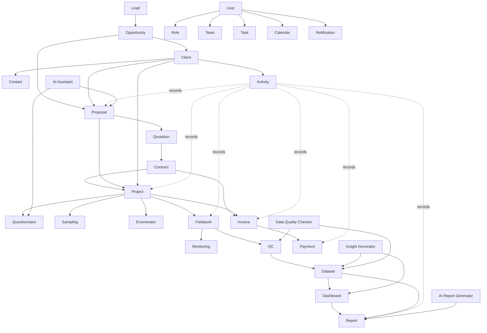

# ResearchAI Domain Model v1.0

Tanggal: 25 Juli 2026
Status: Draft for Review
Pemilik Dokumen: Product Management, Enterprise Architecture, Engineering

---

# 1. Visi ResearchAI

ResearchAI bukan CRM biasa.

ResearchAI adalah Operating System untuk perusahaan riset, khususnya market research, social research, policy research, dan research consulting. Sistem ini dirancang untuk mengelola seluruh siklus bisnis perusahaan riset dari awal peluang bisnis sampai pembayaran dan knowledge reuse.

ResearchAI harus mampu menghubungkan:

- relasi komersial dengan client,
- proses business development,
- pelaksanaan project riset,
- operasional lapangan,
- quality control,
- pengolahan data,
- pembuatan dashboard dan laporan,
- invoice dan pembayaran,
- serta bantuan AI pada setiap tahap kerja.

Dengan demikian, Client bukan hanya data pelanggan. Client adalah pusat hubungan bisnis, project history, proposal history, dokumen, komunikasi, aktivitas, kontrak, invoice, dan insight.

---

# 2. Domain dan Modul Utama

## 2.1 CRM Domain

### Lead

Tujuan:

Mencatat calon client atau peluang awal yang belum memenuhi syarat sebagai opportunity.

Data utama:

- Lead name
- Organization
- Contact information
- Source
- Interest area
- Lead status
- Owner
- Notes

Hubungan:

- Lead dapat berubah menjadi Opportunity.
- Lead dapat memiliki Contact dan Activity.
- Lead dapat ditugaskan ke User atau Team.

Pengguna:

- Business Development
- Marketing
- Research Director
- Management

### Opportunity

Tujuan:

Mengelola peluang bisnis yang sudah lebih jelas dan berpotensi menjadi proposal.

Data utama:

- Opportunity title
- Client or organization
- Estimated value
- Research need
- Probability
- Expected close date
- Opportunity stage
- Owner

Hubungan:

- Opportunity berasal dari Lead atau dibuat langsung.
- Opportunity dapat menjadi Client.
- Opportunity dapat menghasilkan Proposal.
- Opportunity memiliki Activity.

Pengguna:

- Business Development
- Research Director
- Research Manager
- Management

### Client

Tujuan:

Menjadi pusat seluruh informasi client dan relationship history.

Data utama:

- Client name
- Logo
- Address
- City
- Industry
- Client type
- Status
- Customer since
- Last activity
- Next follow up
- Notes

Hubungan:

- Client memiliki banyak Contact.
- Client memiliki banyak Proposal.
- Client memiliki banyak Project.
- Client memiliki banyak Invoice.
- Client memiliki banyak Activity.
- Client memiliki Documents.

Pengguna:

- Business Development
- Research Director
- Research Manager
- Project Manager
- Finance
- Management

### Contact

Tujuan:

Menyimpan orang-orang penting di dalam organisasi client.

Data utama:

- Contact name
- Position
- Email
- Phone
- Mobile phone
- WhatsApp number
- Contact type
- Primary contact flag
- Decision maker flag

Hubungan:

- Contact dimiliki oleh Client.
- Contact dapat terkait dengan Activity, Proposal, Project, dan Invoice.

Pengguna:

- Business Development
- Research Manager
- Project Manager
- Finance

### Activity

Tujuan:

Mencatat seluruh aktivitas penting dalam hubungan dengan client dan lifecycle riset.

Data utama:

- Activity type
- Activity title
- Description
- Activity date
- Source module
- Source ID
- Created by

Hubungan:

- Activity terkait ke Client.
- Activity dapat dihasilkan otomatis oleh Proposal, Project, Survey, Report, Invoice, atau Payment.
- Activity juga dapat dibuat manual oleh User.

Pengguna:

- Semua user operasional
- Management

---

## 2.2 Business Development Domain

### Proposal

Tujuan:

Mengelola dokumen dan metadata proposal riset dari draft sampai approved atau rejected.

Data utama:

- Proposal title
- Client
- Research type
- Research objective
- Methodology summary
- Estimated timeline
- Estimated budget
- Status
- Approved date

Hubungan:

- Proposal dimiliki oleh Client.
- Proposal dapat berasal dari Opportunity.
- Proposal dapat menghasilkan Quotation.
- Proposal yang approved dapat menjadi Contract dan Project.
- Proposal menghasilkan Activity.

Pengguna:

- Business Development
- Research Director
- Research Manager
- Management

### Quotation

Tujuan:

Mengelola penawaran harga, versi harga, dan struktur biaya sebelum kontrak.

Data utama:

- Quotation number
- Proposal
- Client
- Price items
- Tax
- Discount
- Total value
- Valid until
- Status

Hubungan:

- Quotation berasal dari Proposal.
- Quotation dapat menjadi Contract.
- Quotation menjadi dasar Invoice.

Pengguna:

- Business Development
- Finance
- Research Director
- Management

### Contract

Tujuan:

Mencatat kontrak kerja yang disepakati dengan client.

Data utama:

- Contract number
- Client
- Proposal
- Quotation
- Contract value
- Start date
- End date
- Payment terms
- Contract document
- Status

Hubungan:

- Contract berasal dari Proposal dan Quotation.
- Contract menjadi dasar Project dan Invoice.
- Contract terkait ke Documents.

Pengguna:

- Business Development
- Finance
- Legal or Administration
- Management

---

## 2.3 Project Management Domain

### Project

Tujuan:

Mengelola project riset setelah proposal atau kontrak disetujui.

Data utama:

- Project name
- Client
- Proposal
- Contract
- Project manager
- Research type
- Project status
- Contract value
- Start date
- End date
- Timeline

Hubungan:

- Project dimiliki oleh Client.
- Project dapat berasal dari Proposal dan Contract.
- Project memiliki Questionnaire, Sampling, Enumerator, Fieldwork, Monitoring, QC, Dataset, Dashboard, Report, Invoice, dan Activity.

Pengguna:

- Project Manager
- Research Manager
- Research Director
- Data Processing
- Fieldwork Team
- Management

### Questionnaire

Tujuan:

Mengelola instrumen riset, pertanyaan, logic, dan versi kuesioner.

Data utama:

- Questionnaire title
- Project
- Version
- Language
- Question blocks
- Question items
- Validation rules
- Status

Hubungan:

- Questionnaire dimiliki oleh Project.
- Questionnaire digunakan oleh Survey dan Fieldwork.
- Questionnaire dapat dibantu oleh AI Assistant.

Pengguna:

- Research Manager
- Project Manager
- Data Processing
- Fieldwork Team

### Sampling

Tujuan:

Mengelola desain sampel, target responden, kuota, wilayah, dan distribusi sampel.

Data utama:

- Project
- Sampling method
- Target sample size
- Quota structure
- Geography
- Segment
- Status

Hubungan:

- Sampling dimiliki oleh Project.
- Sampling digunakan untuk Fieldwork dan Monitoring.
- Sampling mempengaruhi Dashboard dan QC.

Pengguna:

- Research Manager
- Statistician
- Project Manager
- Fieldwork Manager

### Enumerator

Tujuan:

Mengelola petugas lapangan, assignment, kapasitas kerja, dan performa.

Data utama:

- Enumerator profile
- Region
- Assignment
- Availability
- Performance
- Status

Hubungan:

- Enumerator ditugaskan ke Fieldwork.
- Enumerator menghasilkan submission data.
- Enumerator dipantau oleh Monitoring dan QC.

Pengguna:

- Fieldwork Manager
- Supervisor
- QC Team
- Project Manager

### Fieldwork

Tujuan:

Mengelola pelaksanaan pengumpulan data di lapangan.

Data utama:

- Project
- Survey
- Fieldwork plan
- Assignment
- Submission count
- Completion rate
- Fieldwork status

Hubungan:

- Fieldwork dimiliki oleh Project.
- Fieldwork menggunakan Questionnaire, Sampling, dan Enumerator.
- Fieldwork menghasilkan Dataset.
- Fieldwork dipantau melalui Monitoring dan QC.

Pengguna:

- Fieldwork Manager
- Supervisor
- Enumerator
- Project Manager

### Monitoring

Tujuan:

Memantau progress lapangan, kuota, kualitas, dan risiko project secara real time.

Data utama:

- Project
- Survey
- Completion rate
- Quota achievement
- Enumerator performance
- Issue log
- Alert

Hubungan:

- Monitoring membaca data Fieldwork, Sampling, Enumerator, dan QC.
- Monitoring memberi input ke Project Manager dan Dashboard.

Pengguna:

- Project Manager
- Fieldwork Manager
- Supervisor
- Management

### QC

Tujuan:

Menjamin kualitas data melalui validasi, review, backcheck, dan flagging.

Data utama:

- QC rule
- QC result
- Flagged response
- Backcheck status
- Rejection reason
- QC notes

Hubungan:

- QC terkait Fieldwork dan Dataset.
- QC mempengaruhi status data yang siap diproses.
- AI Data Quality Checker dapat membantu QC.

Pengguna:

- QC Team
- Data Processing
- Project Manager
- Research Manager

---

## 2.4 Data Domain

### Dataset

Tujuan:

Menyimpan data hasil riset yang telah dikumpulkan, dibersihkan, dan siap dianalisis.

Data utama:

- Dataset name
- Project
- Survey
- Source file
- Processing status
- Row count
- Variable metadata
- Quality status

Hubungan:

- Dataset berasal dari Fieldwork dan QC.
- Dataset digunakan oleh Dashboard, Report Generator, Insight Generator, dan Data Quality Checker.

Pengguna:

- Data Processing
- Data Analyst
- Research Manager
- AI Assistant

### Dashboard

Tujuan:

Menampilkan indikator, chart, monitoring, dan insight visual untuk project atau client.

Data utama:

- Dashboard title
- Project
- Dataset
- Metrics
- Charts
- Filters
- Access control

Hubungan:

- Dashboard menggunakan Dataset.
- Dashboard dapat menjadi bahan Report.
- Dashboard dapat digunakan oleh Client Delivery.

Pengguna:

- Research Manager
- Data Analyst
- Project Manager
- Client Viewer
- Management

### Report Generator

Tujuan:

Membantu membuat laporan riset berdasarkan dataset, dashboard, dan insight.

Data utama:

- Report title
- Project
- Dataset
- Sections
- Narrative
- Charts
- Version
- Status

Hubungan:

- Report berasal dari Dataset dan Dashboard.
- Report dapat dibantu AI Insight Generator.
- Report menjadi deliverable untuk Client.

Pengguna:

- Research Manager
- Data Analyst
- Report Writer
- Research Director

---

## 2.5 Finance Domain

### Invoice

Tujuan:

Mengelola tagihan kepada client berdasarkan contract, project, milestone, atau termin pembayaran.

Data utama:

- Invoice number
- Client
- Project
- Contract
- Invoice amount
- Tax
- Due date
- Status
- Issued date
- Paid date

Hubungan:

- Invoice dimiliki Client.
- Invoice dapat terkait Project dan Contract.
- Invoice memiliki Payment.
- Invoice menghasilkan Activity.

Pengguna:

- Finance
- Management
- Business Development

### Payment

Tujuan:

Mencatat pembayaran invoice dari client.

Data utama:

- Invoice
- Payment amount
- Payment date
- Payment method
- Reference number
- Status

Hubungan:

- Payment terkait Invoice.
- Payment memperbarui status Invoice.
- Payment menghasilkan Activity.

Pengguna:

- Finance
- Management

---

## 2.6 Administration Domain

### User

Tujuan:

Mengelola akun pengguna ResearchAI.

Data utama:

- Full name
- Email
- Password hash
- Status
- Last login

Hubungan:

- User memiliki Role.
- User dapat tergabung dalam Team.
- User membuat Activity, Task, Proposal, Project, dan Report.

Pengguna:

- System Administrator
- Semua pengguna internal

### Role

Tujuan:

Mengelola hak akses berdasarkan tanggung jawab kerja.

Data utama:

- Role name
- Description
- Permissions

Hubungan:

- Role diberikan ke User.
- Role mengontrol akses modul.

Pengguna:

- System Administrator
- Management

### Team

Tujuan:

Mengelola kelompok kerja seperti BD, Research, Fieldwork, QC, Data, dan Finance.

Data utama:

- Team name
- Team type
- Members
- Manager

Hubungan:

- Team memiliki User.
- Team dapat ditugaskan ke Project atau Task.

Pengguna:

- Management
- Project Manager
- System Administrator

### Notification

Tujuan:

Memberi pemberitahuan atas aktivitas penting, deadline, assignment, atau perubahan status.

Data utama:

- Recipient
- Notification type
- Message
- Read status
- Source module

Hubungan:

- Notification dapat berasal dari Task, Proposal, Project, Invoice, atau AI alert.

Pengguna:

- Semua pengguna

### Calendar

Tujuan:

Mengelola jadwal meeting, follow up, milestone project, fieldwork, deadline report, dan invoice due date.

Data utama:

- Event title
- Event type
- Date and time
- Participants
- Related module

Hubungan:

- Calendar terkait Client, Activity, Task, Project, dan Invoice.

Pengguna:

- Semua pengguna operasional

### Task

Tujuan:

Mengelola pekerjaan operasional lintas modul.

Data utama:

- Task title
- Assignee
- Due date
- Priority
- Status
- Related module

Hubungan:

- Task dapat terkait Client, Proposal, Project, Survey, QC, Report, atau Invoice.

Pengguna:

- Semua pengguna operasional
- Management

---

## 2.7 AI Domain

### AI Assistant

Tujuan:

Membantu pengguna dalam pekerjaan harian seperti menyusun proposal, merangkum project, membuat draft report, dan menjawab pertanyaan berbasis data ResearchAI.

Data utama:

- Prompt
- Context source
- AI response
- User feedback
- Usage log

Hubungan:

- AI Assistant dapat digunakan di Proposal, Project, Dataset, Report, dan Dashboard.

Pengguna:

- Business Development
- Research Manager
- Data Analyst
- Report Writer
- Management

### Insight Generator

Tujuan:

Membantu menghasilkan insight awal dari dataset dan dashboard.

Data utama:

- Dataset
- Analysis context
- Generated insight
- Confidence note
- Reviewed status

Hubungan:

- Insight Generator menggunakan Dataset dan Dashboard.
- Outputnya dapat masuk ke Report Generator.

Pengguna:

- Data Analyst
- Research Manager
- Report Writer

### AI Report Generator

Tujuan:

Membantu membuat struktur dan narasi laporan riset.

Data utama:

- Report outline
- Section draft
- Chart explanation
- Executive summary
- Recommendation draft

Hubungan:

- AI Report Generator menggunakan Dataset, Dashboard, Insight, dan Report.

Pengguna:

- Research Manager
- Report Writer
- Research Director

### Data Quality Checker

Tujuan:

Membantu mendeteksi masalah kualitas data seperti duplikasi, outlier, pola jawaban tidak wajar, missing value, dan potensi fraud.

Data utama:

- Dataset
- Quality rule
- Flagged record
- Issue type
- Recommendation

Hubungan:

- Data Quality Checker mendukung QC dan Data Processing.
- Outputnya mempengaruhi Dataset readiness.

Pengguna:

- QC Team
- Data Processing
- Data Analyst
- Project Manager

---

# 3. Domain Relationship Diagram

Diagram ini adalah hubungan domain bisnis, bukan ERD database fisik.

---

# 4. End-to-End Business Flow

```mermaid
flowchart LR
    Lead["Lead"] --> Opportunity["Opportunity"]
    Opportunity --> Client["Client"]
    Client --> Proposal["Proposal"]
    Proposal --> Quotation["Quotation"]
    Quotation --> Contract["Contract"]
    Contract --> Project["Project"]
    Project --> Questionnaire["Questionnaire"]
    Questionnaire --> Sampling["Sampling"]
    Sampling --> Enumerator["Enumerator"]
    Enumerator --> Fieldwork["Fieldwork"]
    Fieldwork --> Monitoring["Monitoring"]
    Monitoring --> QC["QC"]
    QC --> Dataset["Dataset"]
    Dataset --> Dashboard["Dashboard"]
    Dashboard --> Report["Report"]
    Report --> Invoice["Invoice"]
    Invoice --> Payment["Payment"]
```

Business meaning:

1. Lead masuk dari channel marketing, referral, existing client, atau inbound request.
2. Lead yang qualified menjadi Opportunity.
3. Opportunity yang valid dibuat atau dihubungkan ke Client.
4. Client menerima Proposal.
5. Proposal memiliki Quotation.
6. Quotation yang disetujui menjadi Contract.
7. Contract memulai Project.
8. Project memiliki Questionnaire, Sampling, Enumerator, dan Fieldwork.
9. Fieldwork dipantau melalui Monitoring dan diperiksa melalui QC.
10. Data lolos QC menjadi Dataset.
11. Dataset menjadi Dashboard dan Report.
12. Report dikirim sebagai deliverable.
13. Invoice diterbitkan.
14. Payment diterima dan dicatat.

---

# 5. MVP dan Phase Berikutnya

## 5.1 MVP Scope

MVP harus fokus pada alur inti yang membuktikan ResearchAI sebagai Operating System, bukan CRM.

MVP modules:

- User
- Role
- Client
- Contact
- Activity basic
- Proposal
- Project basic
- Questionnaire basic
- Sampling basic
- Fieldwork basic
- QC basic
- Dataset basic
- Dashboard basic
- Report basic
- Invoice basic

MVP AI:

- AI Assistant for proposal draft
- Basic Insight Generator
- Basic Report Narrative Assistant

MVP goal:

Membuktikan alur Client -> Proposal -> Project -> Fieldwork -> Dataset -> Report -> Invoice dapat berjalan end-to-end.

## 5.2 Phase 2

Phase 2 memperkuat workflow dan operasional.

Modules:

- Lead
- Opportunity
- Quotation
- Contract
- Enumerator management
- Monitoring dashboard
- Advanced QC
- Client documents
- Calendar
- Task
- Notification

AI:

- Data Quality Checker
- Questionnaire Assistant
- Proposal Assistant with template library

## 5.3 Phase 3

Phase 3 memperkuat automation, finance, dan client delivery.

Modules:

- Payment
- Advanced Invoice
- Client portal
- Document versioning
- Team workload
- Project profitability
- Report approval workflow

AI:

- Advanced Insight Generator
- AI Report Generator
- Executive Summary Generator
- Recommendation Generator

## 5.4 Phase 4

Phase 4 memperkuat enterprise readiness.

Modules:

- Multi-branch organization
- Advanced permission
- Audit log
- Data warehouse integration
- BI integration
- API integration
- Marketplace or plugin architecture

AI:

- Enterprise knowledge assistant
- Cross-project learning
- Automated research recommendation

---

# 6. Development Roadmap Sampai v1.0

## v0.1 Foundation

Target:

Membangun fondasi teknis dan dokumentasi awal.

Scope:

- Product Vision
- Business Requirement
- User Roles
- Functional Requirement
- Database Entity List
- Technology Stack
- System Architecture
- Backend setup
- Database connection
- Authentication
- Frontend setup

Status:

Completed.

## v0.2 Client and Proposal Foundation

Target:

Membangun domain Client dan Proposal sebagai awal relationship operating system.

Scope:

- Client Management Backend
- Client Management Frontend
- Proposal Management Backend
- Client 360 database foundation
- Client domain model review
- Proposal status lifecycle

Status:

In progress.

## v0.3 Client 360 and Proposal Workflow

Target:

Membuat Client sebagai pusat informasi dan proposal sebagai workflow bisnis.

Scope:

- Client list redesign
- Client detail page
- Client overview
- Client contacts
- Client activity timeline
- Proposal frontend
- Proposal detail
- Proposal status update
- Activity auto logging for proposal events

## v0.4 Project Foundation

Target:

Menghubungkan proposal approved menjadi project.

Scope:

- Project backend
- Project frontend
- Project status lifecycle
- Project team assignment
- Project timeline
- Project activity logging

## v0.5 Research Operation Foundation

Target:

Membuat fondasi operasional riset.

Scope:

- Questionnaire module
- Sampling module
- Enumerator module
- Fieldwork module
- Basic monitoring

## v0.6 QC and Data Foundation

Target:

Menghubungkan fieldwork ke data yang siap diproses.

Scope:

- QC module
- Dataset module
- Data upload
- Data validation
- Dataset status
- Basic data quality checker

## v0.7 Dashboard and Report Foundation

Target:

Membuat output riset dapat dipantau dan dilaporkan.

Scope:

- Dashboard module
- Report module
- Report template
- Chart attachment
- Basic insight generator

## v0.8 Finance Foundation

Target:

Menghubungkan pekerjaan riset ke invoice.

Scope:

- Invoice module
- Payment module
- Contract value tracking
- Revenue summary
- Client financial summary

## v0.9 Workflow and AI Enhancement

Target:

Meningkatkan automation lintas domain.

Scope:

- Notification
- Task
- Calendar
- AI Assistant across Proposal, Dataset, and Report
- Activity auto logging across modules
- Role-based access refinement

## v1.0 ResearchAI ERP Release

Target:

ResearchAI siap digunakan sebagai ERP/Operating System internal perusahaan riset.

Scope:

- End-to-end business flow complete
- Client 360 complete
- Proposal to Project workflow complete
- Project operation workflow complete
- Dataset to Report workflow complete
- Invoice to Payment workflow complete
- Dashboard management complete
- Core AI assistance available
- Audit-ready activity timeline
- Documentation and setup guide complete

Success criteria:

- Satu client dapat memiliki banyak proposal, project, report, invoice, contact, dan activity.
- Proposal approved dapat menjadi project.
- Project dapat menghasilkan questionnaire, sampling, fieldwork, QC, dataset, dashboard, dan report.
- Report dapat terhubung ke invoice.
- Payment dapat menutup invoice.
- Activity penting tercatat otomatis.
- Management dapat melihat lifecycle client dan project secara menyeluruh.

---

# 7. Architecture Principles

1. Domain-first, not screen-first.
   ResearchAI harus dibangun berdasarkan domain bisnis riset, bukan hanya halaman UI.

2. Client is the center.
   Semua proposal, project, report, invoice, dan activity harus dapat ditelusuri dari client.

3. Workflow before automation.
   Alur manual harus benar dulu sebelum ditambah AI dan automation.

4. Activity is audit memory.
   Setiap perubahan penting harus meninggalkan jejak activity.

5. AI assists, humans approve.
   AI boleh membantu draft, insight, QC, dan report, tetapi keputusan final tetap pada user.

6. No breaking changes without migration.
   Perubahan database dan API harus bertahap agar fitur yang sudah berjalan tidak rusak.

7. Modular but connected.
   Setiap domain punya batas yang jelas, tetapi data harus saling terhubung.

---

# 8. Review Notes

Dokumen ini menjadi acuan sebelum melanjutkan implementasi Backend API Client 360.

Keputusan yang perlu direview sebelum coding berikutnya:

1. Apakah `Lead` dan `Opportunity` masuk MVP atau Phase 2?
2. Apakah `Quotation` dan `Contract` dibuat sebelum Project, atau ditunda sampai Finance phase?
3. Apakah `client_addresses` perlu dibuat segera, atau alamat utama di `clients` cukup untuk v0.3?
4. Apakah Activity auto logging dimulai dari Proposal terlebih dahulu?
5. Apakah Client Detail v0.3 cukup mencakup Overview, Proposal, Contacts, dan Activity dahulu?
