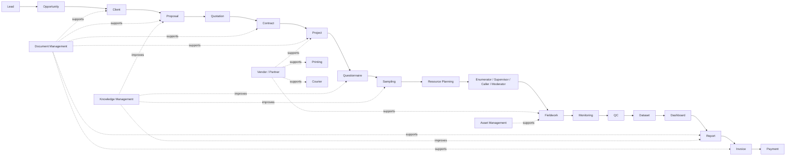

# ResearchAI Domain Model v1.1

Tanggal: 25 Juli 2026
Status: Draft for Review
Pemilik Dokumen: Product Management, Enterprise Architecture, Engineering
Basis revisi: ARCH-001_ResearchAI_Domain_Model_v1.0

---

# 1. Visi ResearchAI

ResearchAI bukan CRM biasa.

ResearchAI adalah Operating System untuk perusahaan riset. Sistem ini dirancang untuk mengelola seluruh siklus bisnis perusahaan riset dari proses mendapatkan peluang, menyusun proposal, menjalankan project, mengelola lapangan, mengolah data, membuat dashboard dan report, sampai invoice, payment, dan knowledge reuse.

ResearchAI harus mampu menghubungkan:

- relasi komersial dengan lead, opportunity, client, dan contact,
- business development melalui proposal, quotation, dan contract,
- project research delivery dari questionnaire sampai report,
- operasional lapangan melalui enumerator, supervisor, QC, moderator, dan caller,
- data dan insight melalui dataset, dashboard, report, dan AI,
- finance melalui invoice dan payment,
- dokumen dan asset operasional,
- vendor dan partner pendukung,
- knowledge perusahaan agar pengalaman project tidak hilang.

Dengan demikian, Client adalah pusat seluruh informasi hubungan bisnis, tetapi ResearchAI secara keseluruhan adalah ERP/Operating System yang menyatukan CRM, delivery, data, finance, resource, vendor, document, asset, knowledge, administration, dan AI.

---

# 2. Alasan Penambahan Domain di v1.1

## 2.1 Knowledge Management

Alasan:

Perusahaan riset sangat bergantung pada pengetahuan berulang: template proposal, template questionnaire, metodologi, report lama, best practice lapangan, dan insight dari project sebelumnya. Tanpa Knowledge Management, ResearchAI hanya menjadi sistem transaksi. Dengan Knowledge Management, ResearchAI menjadi sistem pembelajaran organisasi.

Dampak:

- Proposal lebih cepat dibuat.
- Questionnaire bisa menggunakan reusable question bank.
- Report dapat mengambil struktur dari report yang pernah berhasil.
- AI dapat bekerja dengan konteks internal yang lebih kaya.
- Best practice antar project dapat dipakai ulang.

## 2.2 Resource Management

Alasan:

Research operation tidak hanya dikerjakan oleh user kantor. Banyak peran lapangan dan operasional seperti enumerator, supervisor, QC, moderator, dan caller. Mereka perlu dikelola sebagai resource agar assignment, kapasitas, performa, dan kualitas kerja dapat dipantau.

Dampak:

- Project manager dapat melihat ketersediaan resource.
- Fieldwork manager dapat mengatur assignment.
- QC dapat dilacak performanya.
- Enumerator dan caller dapat dipantau produktivitasnya.
- Moderator dapat ditugaskan ke qualitative research.

## 2.3 Vendor Management

Alasan:

Perusahaan riset sering memakai vendor atau partner eksternal untuk outsourcing fieldwork, rental alat, printing kuesioner/material, courier dokumen, venue, recruitment respondent, dan support lain. Vendor harus tercatat agar biaya, kualitas, dokumen, dan history kerja dapat dikelola.

Dampak:

- Vendor performance dapat dibandingkan.
- Biaya project lebih transparan.
- Procurement lebih tertib.
- Dokumen vendor dan kontrak dapat dilacak.
- Project dapat melihat vendor yang terlibat.

## 2.4 Document Management

Alasan:

Hampir semua domain ResearchAI menghasilkan atau membutuhkan dokumen: client document, proposal, quotation, contract, questionnaire, dataset file, report, invoice, payment proof, dan vendor document. Document Management harus menjadi layanan lintas domain, bukan fitur terpisah yang hanya menempel di satu modul.

Dampak:

- Semua attachment punya struktur yang konsisten.
- Dokumen dapat ditelusuri dari domain asal.
- Versi dokumen dapat dikelola.
- Approval dan audit lebih mudah.
- AI dapat membaca dokumen relevan jika diberi izin.

## 2.5 Asset Management

Alasan:

Project riset, khususnya fieldwork, sering menggunakan asset seperti tablet, laptop, smartphone, modem, printer, dan SIM card. Asset ini perlu dicatat jika ResearchAI ingin menjadi ERP operasional, meskipun tidak wajib masuk MVP.

Dampak:

- Asset dapat ditugaskan ke project atau enumerator.
- Kehilangan atau kerusakan asset dapat dicatat.
- Biaya asset dapat dikaitkan ke project.
- Ketersediaan perangkat fieldwork lebih terkontrol.

Status:

Asset Management disarankan masuk Phase 3 karena penting untuk enterprise readiness, tetapi tidak wajib untuk membuktikan MVP ResearchAI.

---

# 3. Domain dan Modul Utama

## 3.1 CRM Domain

### Lead

Tujuan:

Mencatat calon client atau peluang awal yang belum memenuhi syarat sebagai opportunity.

Data utama:

- Lead name
- Organization
- Contact information
- Lead source
- Interest area
- Lead status
- Owner
- Notes

Hubungan:

- Lead dapat berubah menjadi Opportunity.
- Lead dapat memiliki Contact dan Activity.
- Lead dapat memiliki Document attachment.
- Lead dapat ditugaskan ke User atau Team.

Pengguna:

- Business Development
- Marketing
- Research Director
- Management

### Opportunity

Tujuan:

Mengelola peluang bisnis yang sudah qualified dan berpotensi menjadi proposal.

Data utama:

- Opportunity title
- Organization or Client
- Estimated value
- Research need
- Probability
- Expected close date
- Opportunity stage
- Owner

Hubungan:

- Opportunity berasal dari Lead atau dibuat langsung.
- Opportunity dapat menjadi Client.
- Opportunity dapat menghasilkan Proposal.
- Opportunity memiliki Activity dan Document.

Pengguna:

- Business Development
- Research Director
- Research Manager
- Management

### Client

Tujuan:

Menjadi pusat seluruh informasi relationship, project history, commercial history, document, activity, dan insight client.

Data utama:

- Client name
- Logo
- Address
- City
- Industry
- Client type
- Status
- Customer since
- Last activity
- Next follow up
- Notes

Hubungan:

- Client memiliki banyak Contact.
- Client memiliki banyak Proposal, Project, Invoice, Document, dan Activity.
- Client dapat memiliki banyak Contract dan Quotation.
- Client dapat menjadi konteks utama AI Knowledge Base.

Pengguna:

- Business Development
- Research Director
- Research Manager
- Project Manager
- Finance
- Management

### Contact

Tujuan:

Menyimpan orang-orang penting di dalam organisasi client.

Data utama:

- Contact name
- Position
- Email
- Phone
- Mobile phone
- WhatsApp number
- Contact type
- Primary contact flag
- Decision maker flag

Hubungan:

- Contact dimiliki oleh Client.
- Contact dapat terkait dengan Activity, Proposal, Project, Contract, Invoice, dan Calendar.

Pengguna:

- Business Development
- Research Manager
- Project Manager
- Finance

### Activity

Tujuan:

Mencatat seluruh aktivitas penting dalam lifecycle client, business development, project delivery, finance, dan support.

Data utama:

- Activity type
- Activity title
- Description
- Activity date
- Source module
- Source ID
- Created by

Hubungan:

- Activity terkait ke Client.
- Activity dapat dihasilkan otomatis oleh Proposal, Quotation, Contract, Project, Survey, Fieldwork, Report, Invoice, Payment, Document, Vendor, atau Task.
- Activity juga dapat dibuat manual oleh User.

Pengguna:

- Semua user operasional
- Management

---

## 3.2 Business Development Domain

### Proposal

Tujuan:

Mengelola proposal riset dari draft sampai approved atau rejected.

Data utama:

- Proposal title
- Client
- Opportunity
- Research type
- Research objective
- Methodology summary
- Estimated timeline
- Estimated budget
- Status
- Approved date

Hubungan:

- Proposal dimiliki Client.
- Proposal dapat berasal dari Opportunity.
- Proposal dapat menggunakan Template Library dan Methodology Library.
- Proposal dapat menghasilkan Quotation dan Contract.
- Proposal approved dapat menjadi Project.
- Proposal dapat memiliki Document attachment dan Activity.

Pengguna:

- Business Development
- Research Director
- Research Manager
- Management

### Quotation

Tujuan:

Mengelola penawaran harga, versi harga, dan struktur biaya sebelum kontrak.

Data utama:

- Quotation number
- Proposal
- Client
- Price items
- Tax
- Discount
- Total value
- Valid until
- Status

Hubungan:

- Quotation berasal dari Proposal.
- Quotation dapat menjadi Contract.
- Quotation menjadi dasar Invoice.
- Quotation dapat memiliki Document attachment.

Pengguna:

- Business Development
- Finance
- Research Director
- Management

### Contract

Tujuan:

Mencatat kontrak kerja yang disepakati dengan client.

Data utama:

- Contract number
- Client
- Proposal
- Quotation
- Contract value
- Start date
- End date
- Payment terms
- Contract document
- Status

Hubungan:

- Contract berasal dari Proposal dan Quotation.
- Contract menjadi dasar Project dan Invoice.
- Contract memiliki Document attachment dan Activity.

Pengguna:

- Business Development
- Finance
- Legal or Administration
- Management

---

## 3.3 Project Management Domain

### Project

Tujuan:

Mengelola project riset setelah proposal atau kontrak disetujui.

Data utama:

- Project name
- Client
- Proposal
- Contract
- Project manager
- Research type
- Project status
- Contract value
- Start date
- End date
- Timeline

Hubungan:

- Project dimiliki Client.
- Project dapat berasal dari Proposal dan Contract.
- Project memiliki Questionnaire, Sampling, Resource assignment, Fieldwork, Monitoring, QC, Dataset, Dashboard, Report, Invoice, Document, dan Activity.
- Project dapat melibatkan Vendor dan Asset.

Pengguna:

- Project Manager
- Research Manager
- Research Director
- Data Processing
- Fieldwork Team
- Management

### Questionnaire

Tujuan:

Mengelola instrumen riset, pertanyaan, logic, dan versi kuesioner.

Data utama:

- Questionnaire title
- Project
- Version
- Language
- Question blocks
- Question items
- Validation rules
- Status

Hubungan:

- Questionnaire dimiliki Project.
- Questionnaire dapat dibuat dari Questionnaire Library.
- Questionnaire digunakan oleh Survey dan Fieldwork.
- Questionnaire dapat memiliki Document attachment.
- AI Assistant dapat membantu draft dan review.

Pengguna:

- Research Manager
- Project Manager
- Data Processing
- Fieldwork Team

### Sampling

Tujuan:

Mengelola desain sampel, target responden, kuota, wilayah, dan distribusi sampel.

Data utama:

- Project
- Sampling method
- Target sample size
- Quota structure
- Geography
- Segment
- Status

Hubungan:

- Sampling dimiliki Project.
- Sampling digunakan untuk Fieldwork dan Monitoring.
- Sampling dapat memakai Methodology Library.
- Sampling dapat memiliki Document attachment.

Pengguna:

- Research Manager
- Statistician
- Project Manager
- Fieldwork Manager

### Fieldwork

Tujuan:

Mengelola pelaksanaan pengumpulan data di lapangan atau channel lain.

Data utama:

- Project
- Survey
- Fieldwork plan
- Assignment
- Submission count
- Completion rate
- Fieldwork status

Hubungan:

- Fieldwork dimiliki Project.
- Fieldwork menggunakan Questionnaire, Sampling, Enumerator, Supervisor, Caller, Moderator, Vendor, dan Asset.
- Fieldwork menghasilkan Dataset.
- Fieldwork dipantau oleh Monitoring dan QC.

Pengguna:

- Fieldwork Manager
- Supervisor
- Enumerator
- Caller
- Moderator
- Project Manager

### Monitoring

Tujuan:

Memantau progress lapangan, kuota, kualitas, produktivitas resource, dan risiko project.

Data utama:

- Project
- Survey
- Completion rate
- Quota achievement
- Resource performance
- Issue log
- Alert

Hubungan:

- Monitoring membaca Fieldwork, Sampling, Resource, Vendor, Asset, dan QC.
- Monitoring memberi input ke Project Manager dan Dashboard.

Pengguna:

- Project Manager
- Fieldwork Manager
- Supervisor
- Management

### QC

Tujuan:

Menjamin kualitas data melalui validasi, review, backcheck, dan flagging.

Data utama:

- QC rule
- QC result
- Flagged response
- Backcheck status
- Rejection reason
- QC notes

Hubungan:

- QC terkait Fieldwork dan Dataset.
- QC dapat dilakukan oleh Resource QC internal atau Vendor.
- QC dibantu oleh Data Quality Checker.
- QC mempengaruhi status Dataset.

Pengguna:

- QC Team
- Data Processing
- Project Manager
- Research Manager

---

## 3.4 Resource Management Domain

### Enumerator

Tujuan:

Mengelola petugas pengumpul data di lapangan.

Data utama:

- Enumerator profile
- Region
- Skill
- Availability
- Assignment
- Performance
- Status

Hubungan:

- Enumerator ditugaskan ke Fieldwork.
- Enumerator dipantau oleh Supervisor, Monitoring, dan QC.
- Enumerator dapat menggunakan Asset.

Pengguna:

- Fieldwork Manager
- Supervisor
- Project Manager

### Supervisor

Tujuan:

Mengelola pengawas lapangan yang memastikan fieldwork berjalan sesuai rencana.

Data utama:

- Supervisor profile
- Region
- Team assignment
- Enumerator team
- Performance
- Status

Hubungan:

- Supervisor mengawasi Enumerator dan Caller.
- Supervisor membuat Activity, Issue, dan Monitoring update.

Pengguna:

- Fieldwork Manager
- Project Manager

### QC Resource

Tujuan:

Mengelola personel quality control internal atau eksternal.

Data utama:

- QC profile
- Skill
- Assignment
- QC workload
- QC performance
- Status

Hubungan:

- QC Resource menjalankan QC pada Fieldwork dan Dataset.
- QC Resource menghasilkan QC Activity dan QC Result.

Pengguna:

- QC Manager
- Data Processing
- Project Manager

### Moderator

Tujuan:

Mengelola moderator untuk riset kualitatif seperti FGD, IDI, usability study, dan workshop.

Data utama:

- Moderator profile
- Expertise
- Language
- Availability
- Assignment
- Performance

Hubungan:

- Moderator ditugaskan ke Project qualitative.
- Moderator dapat terkait Questionnaire, Fieldwork, Document, dan Report.

Pengguna:

- Research Manager
- Project Manager
- Qualitative Research Team

### Caller

Tujuan:

Mengelola caller untuk telephone survey, recruitment, reminder, dan verification.

Data utama:

- Caller profile
- Campaign assignment
- Call status
- Productivity
- Quality score
- Availability

Hubungan:

- Caller ditugaskan ke Fieldwork atau recruitment activity.
- Caller menghasilkan Activity dan Monitoring data.

Pengguna:

- Fieldwork Manager
- Supervisor
- QC Team

---

## 3.5 Vendor Management Domain

### Vendor

Tujuan:

Mengelola pihak eksternal yang menyediakan jasa atau barang untuk project riset.

Data utama:

- Vendor name
- Vendor type
- Contact
- Service area
- Pricing
- Performance
- Documents
- Status

Hubungan:

- Vendor dapat terkait Project, Fieldwork, Printing, Rental, Courier, Outsourcing, dan Invoice or expense.
- Vendor memiliki Document dan Activity.

Pengguna:

- Operations
- Project Manager
- Finance
- Management

### Partner

Tujuan:

Mengelola mitra strategis yang bekerja sama dalam research delivery atau business development.

Data utama:

- Partner name
- Partnership type
- Scope
- Contact
- Agreement
- Status

Hubungan:

- Partner dapat terkait Opportunity, Proposal, Project, Contract, dan Document.

Pengguna:

- Management
- Business Development
- Project Manager

### Outsourcing

Tujuan:

Mengelola pekerjaan yang dialihkan ke pihak luar, seperti fieldwork, data entry, transcription, atau recruitment.

Data utama:

- Outsourcing scope
- Vendor
- Project
- Cost
- SLA
- Deliverable
- Status

Hubungan:

- Outsourcing terkait Project, Vendor, Fieldwork, Dataset, Report, dan Invoice or expense.

Pengguna:

- Project Manager
- Operations
- Finance

### Rental

Tujuan:

Mengelola kebutuhan sewa alat, tempat, kendaraan, atau perangkat pendukung project.

Data utama:

- Rental item
- Vendor
- Project
- Rental period
- Cost
- Return status

Hubungan:

- Rental terkait Vendor, Project, Asset, Document, dan Finance.

Pengguna:

- Operations
- Project Manager
- Finance

### Printing

Tujuan:

Mengelola kebutuhan cetak material riset, showcard, kuesioner, report, atau dokumen.

Data utama:

- Printing job
- Vendor
- Project
- Quantity
- Specification
- Cost
- Delivery status

Hubungan:

- Printing terkait Vendor, Project, Questionnaire, Report, Document, dan Courier.

Pengguna:

- Operations
- Research Team
- Project Manager

### Courier

Tujuan:

Mengelola pengiriman dokumen, material fieldwork, hadiah responden, atau report fisik.

Data utama:

- Courier job
- Vendor
- Project
- Recipient
- Tracking number
- Cost
- Delivery status

Hubungan:

- Courier terkait Vendor, Project, Client, Document, Report, Invoice, dan Activity.

Pengguna:

- Administration
- Operations
- Project Manager

---

## 3.6 Document Management Domain

### Document

Tujuan:

Menjadi layanan lintas domain untuk attachment, file, dan dokumen bisnis ResearchAI.

Data utama:

- Document title
- File name
- File type
- File size
- Storage path
- Version
- Source domain
- Source ID
- Uploaded by
- Access level
- Status

Hubungan:

- Document dapat dimiliki oleh Client, Proposal, Quotation, Contract, Project, Questionnaire, Sampling, Dataset, Dashboard, Report, Invoice, Payment, Vendor, Asset, Activity, dan Knowledge item.
- Document dapat digunakan oleh AI Knowledge Base jika diberi izin.

Pengguna:

- Semua user sesuai permission
- AI Assistant sesuai izin akses

Aturan penting:

- Semua domain utama harus dapat memiliki document atau attachment.
- Document harus mendukung versioning pada phase lanjutan.
- Document tidak boleh disimpan sebagai fitur terpisah yang tidak terkait domain.

---

## 3.7 Knowledge Management Domain

### Template Library

Tujuan:

Menyimpan template reusable untuk proposal, quotation, contract, report, email, dan document operasional.

Data utama:

- Template title
- Template type
- Content
- Version
- Owner
- Tags
- Status

Hubungan:

- Template digunakan oleh Proposal, Quotation, Contract, Report, dan AI Assistant.

Pengguna:

- Business Development
- Research Manager
- Report Writer
- Management

### Questionnaire Library

Tujuan:

Menyimpan bank pertanyaan dan template questionnaire yang dapat digunakan ulang.

Data utama:

- Question bank
- Questionnaire template
- Research type
- Question category
- Scale type
- Validation rule
- Version

Hubungan:

- Questionnaire Library digunakan oleh Questionnaire dan AI Assistant.
- Dapat terhubung ke Methodology Library.

Pengguna:

- Research Manager
- Data Processing
- Project Manager

### Report Library

Tujuan:

Menyimpan contoh report, struktur report, narasi, chart pattern, dan executive summary yang dapat dipakai ulang.

Data utama:

- Report template
- Report example
- Section structure
- Chart pattern
- Narrative block
- Tags

Hubungan:

- Report Library digunakan oleh Report Generator, AI Report Generator, dan Insight Generator.

Pengguna:

- Report Writer
- Research Manager
- Data Analyst
- Research Director

### Methodology Library

Tujuan:

Menyimpan metodologi riset, sampling method, analysis framework, dan standard operating method.

Data utama:

- Methodology name
- Research type
- Description
- Sampling approach
- Analysis approach
- Best use case
- Limitation

Hubungan:

- Methodology Library digunakan oleh Proposal, Questionnaire, Sampling, Project, dan AI Assistant.

Pengguna:

- Research Director
- Research Manager
- Business Development
- Data Analyst

### Research Repository

Tujuan:

Menyimpan knowledge dari project yang sudah selesai, termasuk metadata project, learning, report, dataset reference, dan reusable insight.

Data utama:

- Research title
- Client or anonymized client
- Industry
- Research type
- Key findings
- Report reference
- Dataset reference
- Tags
- Access level

Hubungan:

- Research Repository mengambil output dari Project, Dataset, Dashboard, Report, dan Best Practice.
- Menjadi sumber AI Knowledge Base.

Pengguna:

- Research Team
- Business Development
- Management
- AI Assistant

### Best Practice

Tujuan:

Menyimpan pengalaman terbaik, lesson learned, checklist, dan standard playbook.

Data utama:

- Best practice title
- Domain
- Description
- Checklist
- Related project
- Owner
- Tags

Hubungan:

- Best Practice dapat berasal dari Project, Fieldwork, QC, Data Processing, Report, dan Vendor evaluation.
- Digunakan oleh Task, Project, AI Assistant, dan Training.

Pengguna:

- Semua team internal
- Management

### AI Knowledge Base

Tujuan:

Menjadi sumber konteks yang aman dan terstruktur untuk AI Assistant, Insight Generator, Report Generator, dan Data Quality Checker.

Data utama:

- Knowledge source
- Content chunk
- Metadata
- Permission
- Version
- Embedding reference
- Usage log

Hubungan:

- AI Knowledge Base membaca Knowledge Management dan Document Management sesuai permission.
- AI Knowledge Base mendukung AI domain.

Pengguna:

- AI Assistant
- Research Manager
- Data Analyst
- Report Writer
- Management

---

## 3.8 Data Domain

### Dataset

Tujuan:

Menyimpan data hasil riset yang telah dikumpulkan, dibersihkan, dan siap dianalisis.

Data utama:

- Dataset name
- Project
- Survey
- Source file
- Processing status
- Row count
- Variable metadata
- Quality status

Hubungan:

- Dataset berasal dari Fieldwork dan QC.
- Dataset memiliki Document attachment.
- Dataset digunakan oleh Dashboard, Report Generator, Insight Generator, Data Quality Checker, dan Research Repository.

Pengguna:

- Data Processing
- Data Analyst
- Research Manager
- AI Assistant

### Dashboard

Tujuan:

Menampilkan indikator, chart, monitoring, dan insight visual untuk project atau client.

Data utama:

- Dashboard title
- Project
- Dataset
- Metrics
- Charts
- Filters
- Access control

Hubungan:

- Dashboard menggunakan Dataset.
- Dashboard dapat menjadi bahan Report dan Research Repository.
- Dashboard dapat memiliki Document attachment.

Pengguna:

- Research Manager
- Data Analyst
- Project Manager
- Client Viewer
- Management

### Report Generator

Tujuan:

Membantu membuat laporan riset berdasarkan dataset, dashboard, insight, dan library internal.

Data utama:

- Report title
- Project
- Dataset
- Sections
- Narrative
- Charts
- Version
- Status

Hubungan:

- Report berasal dari Dataset dan Dashboard.
- Report dapat menggunakan Report Library dan AI Report Generator.
- Report memiliki Document attachment.
- Report masuk ke Research Repository setelah selesai.

Pengguna:

- Research Manager
- Data Analyst
- Report Writer
- Research Director

---

## 3.9 Finance Domain

### Invoice

Tujuan:

Mengelola tagihan kepada client berdasarkan contract, project, milestone, atau termin pembayaran.

Data utama:

- Invoice number
- Client
- Project
- Contract
- Invoice amount
- Tax
- Due date
- Status
- Issued date
- Paid date

Hubungan:

- Invoice dimiliki Client.
- Invoice dapat terkait Project dan Contract.
- Invoice memiliki Payment.
- Invoice memiliki Document attachment.
- Invoice menghasilkan Activity.

Pengguna:

- Finance
- Management
- Business Development

### Payment

Tujuan:

Mencatat pembayaran invoice dari client.

Data utama:

- Invoice
- Payment amount
- Payment date
- Payment method
- Reference number
- Status

Hubungan:

- Payment terkait Invoice.
- Payment memperbarui status Invoice.
- Payment memiliki Document attachment seperti bukti transfer.
- Payment menghasilkan Activity.

Pengguna:

- Finance
- Management

---

## 3.10 Asset Management Domain

Status:

Opsional Phase 3.

### Asset

Tujuan:

Mengelola perangkat dan asset operasional yang digunakan untuk project riset.

Data utama:

- Asset name
- Asset type
- Serial number
- Status
- Current holder
- Assigned project
- Purchase or rental info
- Condition

Jenis asset:

- Tablet
- Laptop
- Smartphone
- Modem
- Printer
- SIM Card

Hubungan:

- Asset dapat ditugaskan ke Project, Fieldwork, Enumerator, Supervisor, Caller, atau Team.
- Asset dapat terkait Vendor, Rental, Document, dan Activity.

Pengguna:

- Operations
- Fieldwork Manager
- Administration
- Finance

---

## 3.11 Administration Domain

### User

Tujuan:

Mengelola akun pengguna ResearchAI.

Data utama:

- Full name
- Email
- Password hash
- Status
- Last login

Hubungan:

- User memiliki Role.
- User dapat tergabung dalam Team.
- User membuat Activity, Task, Proposal, Project, Report, Document, dan Knowledge item.

Pengguna:

- System Administrator
- Semua pengguna internal

### Role

Tujuan:

Mengelola hak akses berdasarkan tanggung jawab kerja.

Data utama:

- Role name
- Description
- Permissions

Hubungan:

- Role diberikan ke User.
- Role mengontrol akses modul, document, knowledge, dan AI.

Pengguna:

- System Administrator
- Management

### Team

Tujuan:

Mengelola kelompok kerja seperti BD, Research, Fieldwork, QC, Data, Finance, dan Operations.

Data utama:

- Team name
- Team type
- Members
- Manager

Hubungan:

- Team memiliki User dan Resource.
- Team dapat ditugaskan ke Project atau Task.

Pengguna:

- Management
- Project Manager
- System Administrator

### Notification

Tujuan:

Memberi pemberitahuan atas aktivitas penting, deadline, assignment, approval, atau perubahan status.

Data utama:

- Recipient
- Notification type
- Message
- Read status
- Source module

Hubungan:

- Notification dapat berasal dari Task, Proposal, Project, Fieldwork, QC, Invoice, Payment, Document, atau AI alert.

Pengguna:

- Semua pengguna

### Calendar

Tujuan:

Mengelola jadwal meeting, follow up, milestone project, fieldwork, deadline report, dan invoice due date.

Data utama:

- Event title
- Event type
- Date and time
- Participants
- Related module

Hubungan:

- Calendar terkait Client, Contact, Activity, Task, Project, Fieldwork, Invoice, dan Payment.

Pengguna:

- Semua pengguna operasional

### Task

Tujuan:

Mengelola pekerjaan operasional lintas modul.

Data utama:

- Task title
- Assignee
- Due date
- Priority
- Status
- Related module

Hubungan:

- Task dapat terkait Client, Proposal, Project, Survey, QC, Report, Invoice, Vendor, Asset, Document, atau Knowledge item.

Pengguna:

- Semua pengguna operasional
- Management

---

## 3.12 AI Domain

### AI Assistant

Tujuan:

Membantu pengguna dalam pekerjaan harian seperti menyusun proposal, membuat questionnaire, merangkum project, membuat draft report, dan menjawab pertanyaan berbasis data ResearchAI.

Data utama:

- Prompt
- Context source
- AI response
- User feedback
- Usage log

Hubungan:

- AI Assistant menggunakan AI Knowledge Base, Template Library, Questionnaire Library, Methodology Library, Report Library, Document, Dataset, dan Research Repository sesuai permission.

Pengguna:

- Business Development
- Research Manager
- Data Analyst
- Report Writer
- Management

### Insight Generator

Tujuan:

Membantu menghasilkan insight awal dari dataset dan dashboard.

Data utama:

- Dataset
- Analysis context
- Generated insight
- Confidence note
- Reviewed status

Hubungan:

- Insight Generator menggunakan Dataset, Dashboard, Research Repository, dan AI Knowledge Base.
- Outputnya dapat masuk ke Report Generator.

Pengguna:

- Data Analyst
- Research Manager
- Report Writer

### AI Report Generator

Tujuan:

Membantu membuat struktur dan narasi laporan riset.

Data utama:

- Report outline
- Section draft
- Chart explanation
- Executive summary
- Recommendation draft

Hubungan:

- AI Report Generator menggunakan Dataset, Dashboard, Insight, Report Library, Methodology Library, dan Research Repository.

Pengguna:

- Research Manager
- Report Writer
- Research Director

### Data Quality Checker

Tujuan:

Membantu mendeteksi masalah kualitas data seperti duplikasi, outlier, pola jawaban tidak wajar, missing value, dan potensi fraud.

Data utama:

- Dataset
- Quality rule
- Flagged record
- Issue type
- Recommendation

Hubungan:

- Data Quality Checker mendukung QC dan Data Processing.
- Outputnya mempengaruhi Dataset readiness.
- Best Practice dapat dibuat dari pola masalah yang sering muncul.

Pengguna:

- QC Team
- Data Processing
- Data Analyst
- Project Manager

---

# 4. Domain Relationship Diagram

Diagram ini adalah hubungan domain bisnis, bukan ERD database fisik.

```mermaid
flowchart TD
    Lead["Lead"] --> Opportunity["Opportunity"]
    Opportunity --> Client["Client"]
    Client --> Contact["Contact"]
    Client --> Activity["Activity"]

    Opportunity --> Proposal["Proposal"]
    Client --> Proposal
    Proposal --> Quotation["Quotation"]
    Quotation --> Contract["Contract"]
    Contract --> Project["Project"]
    Proposal --> Project
    Client --> Project

    Project --> Questionnaire["Questionnaire"]
    Project --> Sampling["Sampling"]
    Project --> Fieldwork["Fieldwork"]
    Project --> Monitoring["Monitoring"]
    Fieldwork --> Monitoring
    Fieldwork --> QC["QC"]
    QC --> Dataset["Dataset"]
    Dataset --> Dashboard["Dashboard"]
    Dashboard --> Report["Report"]
    Dataset --> Report

    Resource["Resource Management"] --> Enumerator["Enumerator"]
    Resource --> Supervisor["Supervisor"]
    Resource --> QCResource["QC Resource"]
    Resource --> Moderator["Moderator"]
    Resource --> Caller["Caller"]
    Enumerator --> Fieldwork
    Supervisor --> Fieldwork
    QCResource --> QC
    Moderator --> Fieldwork
    Caller --> Fieldwork

    VendorManagement["Vendor Management"] --> Vendor["Vendor"]
    VendorManagement --> Partner["Partner"]
    VendorManagement --> Outsourcing["Outsourcing"]
    VendorManagement --> Rental["Rental"]
    VendorManagement --> Printing["Printing"]
    VendorManagement --> Courier["Courier"]
    Vendor --> Project
    Outsourcing --> Fieldwork
    Rental --> Project
    Printing --> Questionnaire
    Printing --> Report
    Courier --> Client

    Contract --> Invoice["Invoice"]
    Project --> Invoice
    Invoice --> Payment["Payment"]

    Document["Document Management"] -. attaches to .-> Client
    Document -. attaches to .-> Proposal
    Document -. attaches to .-> Contract
    Document -. attaches to .-> Project
    Document -. attaches to .-> Questionnaire
    Document -. attaches to .-> Dataset
    Document -. attaches to .-> Report
    Document -. attaches to .-> Invoice

    Knowledge["Knowledge Management"] --> TemplateLibrary["Template Library"]
    Knowledge --> QuestionnaireLibrary["Questionnaire Library"]
    Knowledge --> ReportLibrary["Report Library"]
    Knowledge --> MethodologyLibrary["Methodology Library"]
    Knowledge --> ResearchRepository["Research Repository"]
    Knowledge --> BestPractice["Best Practice"]
    Knowledge --> AIKnowledgeBase["AI Knowledge Base"]
    TemplateLibrary --> Proposal
    QuestionnaireLibrary --> Questionnaire
    MethodologyLibrary --> Sampling
    ReportLibrary --> Report
    ResearchRepository --> AIKnowledgeBase
    BestPractice --> AIKnowledgeBase

    AssetManagement["Asset Management"] --> Asset["Asset"]
    Asset --> Fieldwork
    Asset --> Enumerator
    Rental --> Asset

    User["User"] --> Role["Role"]
    User --> Team["Team"]
    User --> Task["Task"]
    User --> Calendar["Calendar"]
    User --> Notification["Notification"]

    Activity -. records .-> Proposal
    Activity -. records .-> Project
    Activity -. records .-> Fieldwork
    Activity -. records .-> Report
    Activity -. records .-> Invoice
    Activity -. records .-> Payment
    Activity -. records .-> Document
    Activity -. records .-> Vendor

    AIAssistant["AI Assistant"] --> AIKnowledgeBase
    AIAssistant --> Proposal
    AIAssistant --> Questionnaire
    InsightGenerator["Insight Generator"] --> Dataset
    InsightGenerator --> Dashboard
    AIReportGenerator["AI Report Generator"] --> Report
    DataQualityChecker["Data Quality Checker"] --> QC
    DataQualityChecker --> Dataset
```

---

# 5. End-to-End Business Flow

Flow utama tetap sama, tetapi v1.1 menambahkan document, vendor, resource, asset, dan knowledge sebagai domain pendukung lintas proses.

Business meaning:

1. Lead masuk dari marketing, referral, existing client, inbound request, atau partner.
2. Lead yang qualified menjadi Opportunity.
3. Opportunity yang valid dibuat atau dihubungkan ke Client.
4. Client menerima Proposal yang dapat memakai Template Library dan Methodology Library.
5. Proposal memiliki Quotation dan kemudian Contract.
6. Contract memulai Project.
7. Project memiliki Questionnaire, Sampling, Resource Planning, Fieldwork, Monitoring, dan QC.
8. Resource Management mengatur enumerator, supervisor, QC, moderator, dan caller.
9. Vendor Management mendukung outsourcing, rental, printing, dan courier jika diperlukan.
10. Asset Management mendukung perangkat fieldwork pada phase lanjutan.
11. QC menghasilkan Dataset yang siap dianalisis.
12. Dataset menjadi Dashboard dan Report.
13. Report masuk ke Research Repository dan dapat memperkaya AI Knowledge Base.
14. Invoice diterbitkan dan Payment diterima.
15. Document Management menempel di seluruh proses sebagai attachment, versioning, dan audit support.
16. Activity mencatat event penting lintas proses.

---

# 6. MVP dan Phase Berikutnya

## 6.1 MVP Scope

MVP harus membuktikan ResearchAI sebagai Operating System riset end-to-end, tetapi tetap fokus pada alur minimum yang bisa berjalan.

MVP modules:

- User
- Role
- Client
- Contact
- Activity basic
- Document attachment basic
- Proposal
- Project basic
- Questionnaire basic
- Sampling basic
- Resource basic: Enumerator, Supervisor, QC
- Fieldwork basic
- Monitoring basic
- QC basic
- Dataset basic
- Dashboard basic
- Report basic
- Invoice basic

MVP Knowledge:

- Template Library basic
- Questionnaire Library basic
- Methodology Library basic

MVP AI:

- AI Assistant for proposal draft
- Basic Insight Generator
- Basic Report Narrative Assistant

MVP goal:

Membuktikan alur Client -> Proposal -> Project -> Fieldwork -> Dataset -> Report -> Invoice dapat berjalan end-to-end, dengan document dan activity tercatat minimal.

## 6.2 Phase 2

Phase 2 memperkuat business development, operational workflow, vendor, dan knowledge reuse.

Modules:

- Lead
- Opportunity
- Quotation
- Contract
- Vendor
- Partner
- Outsourcing
- Printing
- Courier
- Caller
- Moderator
- Client documents
- Calendar
- Task
- Notification
- Research Repository
- Report Library
- Best Practice

AI:

- Data Quality Checker
- Questionnaire Assistant
- Proposal Assistant with template library
- AI Knowledge Base basic

## 6.3 Phase 3

Phase 3 memperkuat enterprise resource, finance, asset, dan client delivery.

Modules:

- Payment
- Advanced Invoice
- Client portal
- Document versioning
- Team workload
- Project profitability
- Asset Management
- Rental
- Report approval workflow
- Vendor performance

AI:

- Advanced Insight Generator
- AI Report Generator
- Executive Summary Generator
- Recommendation Generator
- AI Knowledge Base with permission-aware retrieval

## 6.4 Phase 4

Phase 4 memperkuat enterprise readiness dan scale.

Modules:

- Multi-branch organization
- Advanced permission
- Audit log
- Data warehouse integration
- BI integration
- API integration
- Marketplace or plugin architecture
- Advanced vendor procurement
- Advanced asset lifecycle

AI:

- Enterprise knowledge assistant
- Cross-project learning
- Automated research recommendation
- AI-assisted project risk detection

---

# 7. Development Roadmap Sampai v1.0

## v0.1 Foundation

Target:

Membangun fondasi teknis dan dokumentasi awal.

Scope:

- Product Vision
- Business Requirement
- User Roles
- Functional Requirement
- Database Entity List
- Technology Stack
- System Architecture
- Backend setup
- Database connection
- Authentication
- Frontend setup

Status:

Completed.

## v0.2 Client and Proposal Foundation

Target:

Membangun domain Client dan Proposal sebagai awal relationship operating system.

Scope:

- Client Management Backend
- Client Management Frontend
- Proposal Management Backend
- Client 360 database foundation
- Client domain model review
- Proposal status lifecycle
- ResearchAI Domain Model v1.1

Status:

In progress.

## v0.3 Client 360 and Document Foundation

Target:

Membuat Client sebagai pusat informasi dan menyiapkan attachment lintas domain.

Scope:

- Client list redesign
- Client detail page
- Client overview
- Client contacts
- Client activity timeline
- Document Management basic
- Attachment support for Client, Proposal, Contract, Project, Report, Invoice, Questionnaire, and Dataset
- Proposal frontend
- Proposal detail
- Proposal status update
- Activity auto logging for proposal events

## v0.4 Project and Resource Foundation

Target:

Menghubungkan proposal approved menjadi project dan mulai mengelola resource delivery.

Scope:

- Project backend
- Project frontend
- Project status lifecycle
- Project team assignment
- Enumerator basic
- Supervisor basic
- QC resource basic
- Project timeline
- Project activity logging

## v0.5 Research Operation Foundation

Target:

Membuat fondasi operasional riset.

Scope:

- Questionnaire module
- Questionnaire Library basic
- Sampling module
- Fieldwork module
- Caller basic
- Moderator basic
- Basic monitoring
- Vendor support for outsourcing

## v0.6 QC, Data, and Knowledge Foundation

Target:

Menghubungkan fieldwork ke data yang siap diproses dan mulai membangun knowledge reuse.

Scope:

- QC module
- Dataset module
- Data upload
- Data validation
- Dataset status
- Basic data quality checker
- Methodology Library
- Research Repository basic
- Best Practice basic

## v0.7 Dashboard and Report Foundation

Target:

Membuat output riset dapat dipantau, dilaporkan, dan digunakan ulang.

Scope:

- Dashboard module
- Report module
- Report Library
- Report template
- Chart attachment
- Basic insight generator
- Report to Research Repository flow

## v0.8 Finance and Vendor Foundation

Target:

Menghubungkan pekerjaan riset ke invoice, payment, dan vendor cost.

Scope:

- Invoice module
- Payment module
- Contract value tracking
- Revenue summary
- Vendor Management basic
- Printing, Courier, Rental tracking
- Client financial summary

## v0.9 Workflow, Asset, and AI Enhancement

Target:

Meningkatkan automation lintas domain dan enterprise support.

Scope:

- Notification
- Task
- Calendar
- Asset Management basic
- AI Assistant across Proposal, Questionnaire, Dataset, and Report
- AI Knowledge Base basic
- Activity auto logging across modules
- Role-based access refinement

## v1.0 ResearchAI ERP Release

Target:

ResearchAI siap digunakan sebagai ERP/Operating System internal perusahaan riset.

Scope:

- End-to-end business flow complete
- Client 360 complete
- Proposal to Project workflow complete
- Project operation workflow complete
- Resource assignment complete
- Vendor support available
- Document attachment across core domains
- Dataset to Report workflow complete
- Invoice to Payment workflow complete
- Dashboard management complete
- Core Knowledge Management available
- Core AI assistance available
- Audit-ready activity timeline
- Documentation and setup guide complete

Success criteria:

- Satu client dapat memiliki banyak proposal, project, report, invoice, contact, document, dan activity.
- Proposal approved dapat menjadi project.
- Project dapat menghasilkan questionnaire, sampling, fieldwork, QC, dataset, dashboard, dan report.
- Resource seperti enumerator, supervisor, QC, moderator, dan caller dapat ditugaskan ke project.
- Vendor dapat dicatat untuk outsourcing, rental, printing, dan courier.
- Semua domain utama dapat memiliki attachment.
- Report dan lesson learned dapat masuk ke Research Repository.
- Invoice dapat ditutup oleh Payment.
- Activity penting tercatat otomatis.
- AI dapat membantu proposal, questionnaire, insight, report, dan data quality dengan knowledge yang terkontrol permission.

---

# 8. Architecture Principles

1. Domain-first, not screen-first.
   ResearchAI harus dibangun berdasarkan domain bisnis riset, bukan hanya halaman UI.

2. Client is the relationship center.
   Semua proposal, project, report, invoice, contact, document, dan activity harus dapat ditelusuri dari client.

3. Project is the delivery center.
   Questionnaire, sampling, resource, vendor, fieldwork, QC, dataset, dashboard, report, dan invoice harus dapat ditelusuri dari project.

4. Document is a cross-domain service.
   Semua domain utama harus dapat memiliki attachment dengan source domain, source ID, access level, dan versioning pada phase lanjutan.

5. Activity is audit memory.
   Setiap perubahan penting harus meninggalkan jejak activity, baik otomatis maupun manual.

6. Knowledge must be reusable.
   Template, methodology, questionnaire, report, best practice, dan research repository harus bisa digunakan ulang oleh manusia dan AI.

7. AI assists, humans approve.
   AI boleh membantu draft, insight, QC, report, dan recommendation, tetapi keputusan final tetap pada user.

8. Permission-aware AI.
   AI hanya boleh menggunakan knowledge dan document yang sesuai dengan hak akses user.

9. Workflow before automation.
   Alur manual harus benar dulu sebelum ditambah AI dan automation.

10. No breaking changes without migration.
    Perubahan database dan API harus bertahap agar fitur yang sudah berjalan tidak rusak.

11. Modular but connected.
    Setiap domain punya batas yang jelas, tetapi data harus saling terhubung.

12. Operational reality matters.
    ResearchAI harus mendukung resource, vendor, asset, dan dokumen karena perusahaan riset beroperasi di lapangan, bukan hanya di layar dashboard.

---

# 9. Review Notes

Dokumen ini menjadi acuan sebelum melanjutkan implementasi Backend API Client 360 dan domain berikutnya.

Keputusan yang perlu direview sebelum coding berikutnya:

1. Apakah Document Management basic masuk sebelum Client Detail v0.3?
2. Apakah `client_addresses` dibuat sebagai domain terpisah atau alamat utama di `clients` cukup sampai v0.3?
3. Apakah Resource basic hanya mencakup Enumerator, Supervisor, dan QC dulu untuk MVP?
4. Apakah Vendor Management ditunda ke Phase 2 setelah Project basic selesai?
5. Apakah Knowledge Management dimulai dari Template Library dan Methodology Library dulu?
6. Apakah AI Knowledge Base dibuat setelah Document Management dan Knowledge Management basic tersedia?
7. Apakah Activity auto logging dimulai dari Proposal, lalu Project, lalu Invoice?
