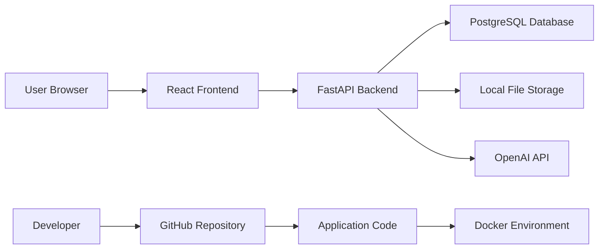
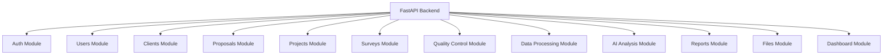
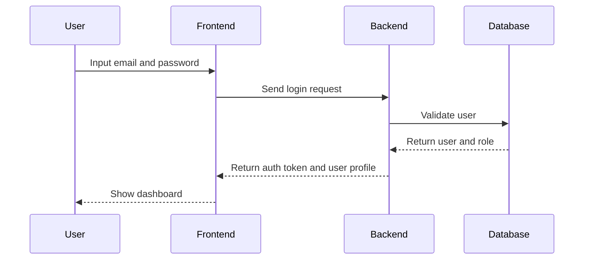
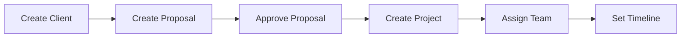
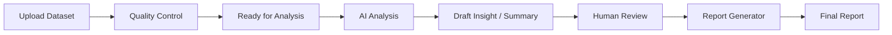
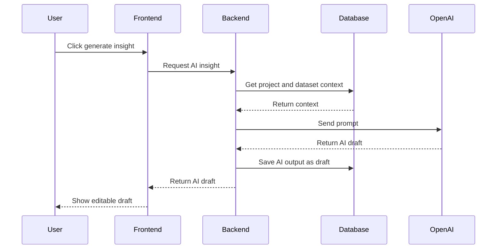
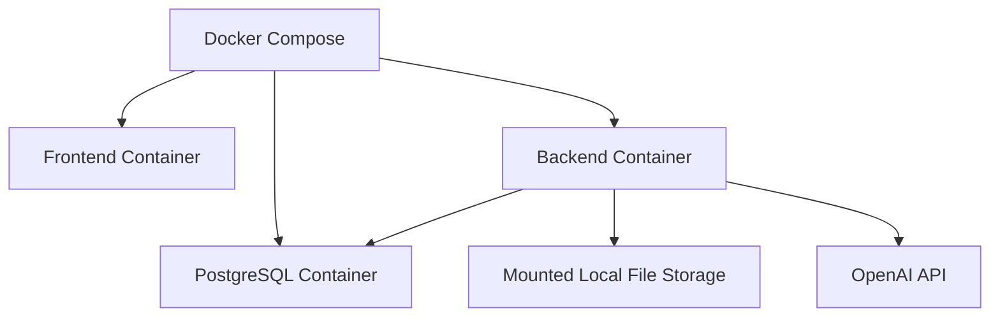

# System Architecture

## ResearchAI Platform

**Version:** 0.1

**Status:** Draft

**Document Owner:** Beerka Research

**Date:** 8 Juli 2026

---

# 1. Tujuan Dokumen

Dokumen ini menjelaskan arsitektur sistem awal ResearchAI pada tahap MVP.

System Architecture menjadi dasar untuk menyusun Database Schema, API Requirement, Development Setup Guide, Deployment Plan, dan implementasi teknis aplikasi.

---

# 2. Ringkasan Arsitektur

ResearchAI menggunakan arsitektur web application dengan frontend, backend API, database, file storage, dan integrasi AI.

Komponen utama:

- User Browser
- Frontend Web App
- Backend API
- PostgreSQL Database
- Local File Storage
- OpenAI API
- GitHub Repository
- Docker Environment

---

# 3. High-Level Architecture

---

# 4. Komponen Sistem

## 4.1 User Browser

Fungsi:

Tempat pengguna mengakses ResearchAI melalui browser.

Pengguna:

- System Administrator
- Research Director
- Research Manager
- Project Manager
- Marketing
- Data Processing
- Data Analyst
- Quality Control

Tanggung jawab:

- Menampilkan halaman aplikasi
- Mengirim input pengguna ke frontend
- Menerima tampilan hasil dari frontend

Prioritas:

High

---

## 4.2 Frontend Web App

Teknologi:

React + Tailwind CSS

Fungsi:

Menampilkan antarmuka ResearchAI kepada pengguna.

Tanggung jawab:

- Login page
- Dashboard
- Client pages
- Proposal pages
- Project pages
- Survey pages
- Quality control pages
- Data processing pages
- AI analysis pages
- Report pages
- User management pages

Komunikasi:

- Mengirim request ke Backend API
- Menerima response JSON dari Backend API
- Menampilkan data sesuai role pengguna

Prioritas:

High

---

## 4.3 Backend API

Teknologi:

Python + FastAPI

Fungsi:

Menjadi pusat logika aplikasi ResearchAI.

Tanggung jawab:

- Authentication
- Authorization
- Business logic
- Client management
- Proposal management
- Project management
- Survey management
- Quality control
- Data processing
- AI integration
- Report generator
- File upload
- Database access

Komunikasi:

- Menerima request dari Frontend
- Membaca dan menulis data ke PostgreSQL
- Menyimpan dan mengambil file dari File Storage
- Mengirim request ke OpenAI API untuk fitur AI

Prioritas:

High

---

## 4.4 PostgreSQL Database

Teknologi:

PostgreSQL

Fungsi:

Menyimpan data utama ResearchAI.

Data yang disimpan:

- Users
- Roles
- Clients
- Contacts
- Proposals
- Projects
- Surveys
- Quality checks
- Datasets metadata
- AI outputs
- Reports
- Knowledge items
- Activity logs

Prioritas:

High

---

## 4.5 Local File Storage

Teknologi:

Local storage pada tahap awal

Fungsi:

Menyimpan file yang diunggah pengguna.

File yang disimpan:

- Proposal files
- Dataset files
- Report files
- Project documents

Catatan:

Database hanya menyimpan metadata file, sedangkan file fisik disimpan di file storage.

Rencana lanjutan:

Pada tahap production, local file storage dapat diganti dengan S3-compatible storage atau cloud storage.

Prioritas:

Medium

---

## 4.6 OpenAI API

Teknologi:

OpenAI API

Fungsi:

Menyediakan kemampuan AI untuk membantu pekerjaan riset.

Digunakan untuk:

- Draft proposal
- Project summary
- Insight draft
- Executive summary
- Recommendation draft
- Report narrative draft

Prinsip:

- Backend yang berkomunikasi langsung dengan OpenAI API.
- Frontend tidak menyimpan API key.
- Output AI disimpan sebagai draft.
- Output AI harus dapat direview dan diedit manusia.

Prioritas:

High

---

## 4.7 GitHub Repository

Fungsi:

Menyimpan dokumentasi, kode, dan riwayat perubahan ResearchAI.

Repository:

https://github.com/saharailal2020-code/ResearchAI

Prioritas:

High

---

## 4.8 Docker Environment

Fungsi:

Menjalankan komponen aplikasi dalam environment yang konsisten.

Komponen Docker pada tahap awal:

- Backend service
- Frontend service
- PostgreSQL service

Prioritas:

Medium

---

# 5. Backend Internal Modules

Backend ResearchAI dibagi menjadi modul:

- auth
- users
- clients
- proposals
- projects
- surveys
- quality_control
- data_processing
- ai_analysis
- reports
- files
- dashboard
- settings

Diagram:

---

# 6. Data Flow Utama

## 6.1 Login Flow

---

## 6.2 Client to Project Flow

---

## 6.3 Data to AI to Report Flow

---

# 7. API Communication Pattern

Frontend berkomunikasi dengan backend melalui HTTP API.

Format umum:

- Request: JSON
- Response: JSON
- Authentication: token-based authentication
- File upload: multipart form data

Contoh endpoint awal:

- POST /auth/login
- POST /auth/logout
- GET /clients
- POST /clients
- GET /proposals
- POST /proposals
- GET /projects
- POST /projects
- POST /datasets/upload
- POST /ai/project-summary
- POST /reports

Catatan:

Daftar lengkap endpoint akan dibuat pada dokumen API Requirement v0.1.

---

# 8. Data Storage Pattern

ResearchAI memisahkan data menjadi:

## 8.1 Structured Data

Disimpan di PostgreSQL.

Contoh:

- User profile
- Client information
- Proposal metadata
- Project status
- Dataset metadata
- AI output text
- Report content

## 8.2 File Data

Disimpan di Local File Storage.

Contoh:

- Uploaded proposal document
- Uploaded dataset file
- Exported report file

Database menyimpan metadata dan lokasi file.

---

# 9. AI Integration Pattern

Alur integrasi AI:

1. User memilih fitur AI di frontend.
2. Frontend mengirim request ke backend.
3. Backend mengambil data terkait dari database.
4. Backend menyusun prompt.
5. Backend mengirim request ke OpenAI API.
6. OpenAI API mengembalikan output.
7. Backend menyimpan output sebagai draft.
8. Frontend menampilkan draft untuk direview manusia.

Diagram:

---

# 10. Security Architecture

Prinsip keamanan awal:

- Password tidak disimpan dalam bentuk plain text.
- API key OpenAI disimpan di backend environment variable.
- Frontend tidak mengetahui API key OpenAI.
- Setiap request internal memerlukan authentication.
- Role digunakan untuk membatasi akses menu dan data.
- Data sensitif hanya ditampilkan kepada pengguna yang berwenang.

Komponen keamanan:

- Authentication
- Authorization
- Role-based access control
- Password hashing
- Environment variables
- Activity log pada tahap lanjutan

---

# 11. Deployment Architecture MVP

Pada tahap development dan MVP awal, ResearchAI dapat dijalankan dengan Docker.

Komponen:

- frontend
- backend
- postgres
- local file volume

---

# 12. Environment Variables

Environment variable awal:

- DATABASE_URL
- SECRET_KEY
- OPENAI_API_KEY
- FILE_STORAGE_PATH
- APP_ENV
- FRONTEND_URL

Catatan:

File environment tidak boleh di-commit ke GitHub jika berisi secret.

---

# 13. Batasan Arsitektur v0.1

Arsitektur v0.1 belum mencakup:

- Kubernetes
- Multi-tenant architecture
- Public API gateway
- Advanced audit system
- Advanced backup strategy
- Real-time notification
- Mobile app architecture
- Client portal architecture detail

Batasan ini disengaja agar MVP tetap fokus.

---

# 14. Dokumen Terkait

- Technology Stack v0.1
- Database Entity List v0.1
- UI/UX User Flow v0.1
- Functional Requirement v0.1
- Module Roadmap v0.1

---

# 15. Status

Dokumen ini masih berstatus draft dan akan diperbarui setelah Database Schema, API Requirement, dan Development Setup Guide dibuat.
