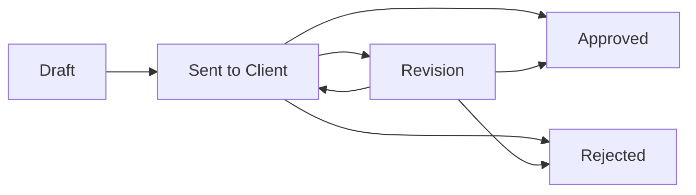

# Proposal Workflow MVP v0.1

Tanggal: 26 Juli 2026
Status: Final Draft for Product Owner Review
Basis: ResearchAI Domain Model v1.1
Scope: Sprint Planning sebelum Proposal Management Frontend

---

# 1. Tujuan Dokumen

Dokumen ini menjadi acuan desain untuk sprint Proposal Management Frontend.

Pada tahap ini tidak ada implementasi kode, perubahan database, perubahan backend, perubahan frontend, atau perubahan API. Fokus dokumen ini adalah menyepakati workflow Proposal MVP agar implementasi berikutnya tidak melebar dan tetap konsisten dengan ResearchAI sebagai Operating System untuk perusahaan riset.

---

# 2. Review Domain Model v1.1

Dalam Domain Model v1.1, Proposal berada di Business Development Domain.

Peran Proposal:

- Proposal adalah jembatan dari Client atau Opportunity menuju Project.
- Proposal dimiliki oleh Client.
- Proposal dapat menggunakan Template Library dan Methodology Library pada phase lanjutan.
- Proposal dapat menghasilkan Quotation dan Contract pada phase lanjutan.
- Proposal yang Approved dapat menjadi Project pada phase berikutnya.
- Proposal harus menghasilkan Activity ke Client Activity Timeline.

Untuk MVP saat ini, Lead, Opportunity, Quotation, Contract, Document Management, dan Project creation belum menjadi scope implementasi sprint Proposal Frontend. Karena itu Proposal MVP harus tetap sederhana, tetapi cukup kuat untuk menjadi pondasi alur Client -> Proposal -> Project.

---

# 3. Prinsip Proposal MVP

1. Proposal harus selalu terhubung ke Client.
2. Proposal adalah business object, bukan hanya file upload.
3. Proposal harus memiliki Proposal Number yang unik dan otomatis dibuat sistem.
4. Proposal harus memiliki Proposal Owner yang otomatis diisi dari user pembuat proposal.
5. Proposal status harus mencerminkan proses bisnis.
6. Proposal activity wajib masuk ke Client Activity Timeline.
7. Proposal Frontend tidak boleh membuat Project Management.
8. Proposal Frontend tidak boleh membuat Quotation dan Contract.
9. Proposal Frontend tidak boleh mengubah Client Management yang sudah berjalan.
10. Proposal MVP harus backward compatible dengan API dan database yang sudah ada.

---

# 4. Business Flow Proposal MVP

Flow utama:



Makna status:

## Draft

Proposal baru dibuat dan masih disusun internal.

User dapat:

- membuat proposal,
- mengedit informasi proposal,
- menyimpan objective,
- menyimpan methodology summary,
- menyimpan estimated timeline,
- menyimpan estimated budget.

## Sent to Client

Proposal sudah dikirim ke client.

User dapat:

- melihat proposal,
- mengubah status menjadi Revision, Approved, atau Rejected.

Catatan implementasi:

- Status backend dapat tetap menggunakan nilai `Sent` untuk menjaga kompatibilitas.
- UI menampilkan label `Sent to Client`.

## Revision

Proposal membutuhkan revisi setelah feedback client.

User dapat:

- mengedit proposal,
- mengirim ulang menjadi Sent to Client,
- mengubah status menjadi Approved atau Rejected jika sudah ada keputusan.

Catatan implementasi:

- Status backend dapat tetap menggunakan nilai `Revised` untuk menjaga kompatibilitas.
- UI menampilkan label `Revision`.

## Approved

Proposal disetujui client.

User dapat:

- melihat proposal,
- menjadikan proposal sebagai kandidat Project pada phase Project Management berikutnya.

Catatan MVP:

- Tombol Create Project belum dibuat pada sprint Proposal Frontend.
- Jika perlu, cukup tampilkan label atau placeholder "Ready for Project".

## Rejected

Proposal ditolak atau tidak dilanjutkan.

User dapat:

- melihat proposal,
- menyimpan status sebagai historical record.

## Status yang Ditunda

Internal Review ditunda ke versi berikutnya.

Alasan:

- Internal Review membutuhkan workflow approval internal.
- Internal Review membutuhkan permission atau role reviewer yang lebih jelas.
- Internal Review berpotensi memperlambat pembuatan proposal MVP.
- MVP saat ini lebih membutuhkan alur cepat dari draft ke client.

---

# 5. Entity Proposal MVP

Entity Proposal yang sudah ada saat ini:

- id
- proposal_number
- client_id
- proposal_title
- proposal_owner_id
- research_type
- research_objective
- methodology_summary
- estimated_timeline
- estimated_budget
- status
- created_by
- approved_at
- created_at
- updated_at

Field yang diperlukan untuk MVP:

| Field | Wajib | Keterangan |
| --- | --- | --- |
| proposal_number | Ya | Nomor proposal unik, otomatis dibuat sistem |
| client_id | Ya | Proposal harus dimiliki Client |
| proposal_title | Ya | Nama proposal |
| proposal_owner_id | Ya | Otomatis dari user pembuat proposal |
| research_type | Tidak | Jenis riset, misalnya CSAT, Brand Tracking, U&A |
| research_objective | Tidak | Tujuan riset |
| methodology_summary | Tidak | Ringkasan metodologi |
| estimated_timeline | Tidak | Estimasi durasi |
| estimated_budget | Tidak | Estimasi nilai proposal |
| status | Ya | Draft, Sent, Revised, Approved, Rejected |
| approved_at | Otomatis | Terisi saat status Approved |

Rekomendasi:

Struktur Proposal saat ini hampir cukup untuk MVP, tetapi keputusan Product Owner menetapkan bahwa Proposal Number dan Proposal Owner wajib ada sejak MVP.

Implikasi desain untuk implementasi berikutnya:

- `proposal_number` perlu dibuat otomatis oleh sistem.
- Format nomor tidak perlu kompleks.
- Yang penting unik dan mudah dibaca.
- `proposal_owner_id` default dari user yang membuat proposal.
- Proposal Owner tidak perlu dipilih manual pada create form MVP.

Format proposal number MVP yang disarankan:

```text
PROP-YYYYMMDD-XXXX
```

Contoh:

```text
PROP-20260726-0001
```

Format ini cukup untuk MVP. Format yang lebih kompleks dapat ditunda.

Field yang sebaiknya ditunda:

- proposal_version
- submitted_at
- rejected_at
- rejection_reason
- quotation_id
- contract_id
- file attachment
- AI draft content

Alasan ditunda:

Field tersebut penting untuk fase lanjutan, tetapi belum wajib untuk membuktikan workflow Proposal MVP. Menambah terlalu banyak field sekarang akan memperbesar scope dan memperlambat validasi alur dasar.

Catatan:

`proposal_number` tidak lagi ditunda karena sudah menjadi keputusan Product Owner untuk MVP.

---

# 6. Proposal List

Tujuan:

Menampilkan seluruh proposal dan memudahkan user melihat pipeline awal business development.

Data yang ditampilkan:

- Proposal number
- Proposal title
- Client name
- Research type
- Estimated budget
- Proposal owner
- Status
- Created date

Filter MVP:

- Status
- Client
- Research type

Search MVP:

- Proposal title

Sorting MVP:

- Terbaru
- Estimated budget terbesar
- Status

Action:

- Add Proposal
- Open Proposal Detail

Empty state:

"Belum ada proposal. Buat proposal pertama untuk client yang sudah tersedia."

Catatan:

Proposal List tidak perlu menjadi kanban pada MVP. Tabel atau list profesional lebih cukup dan lebih cepat diimplementasikan.

---

# 7. Proposal Detail

Tujuan:

Menjadi halaman utama untuk membaca satu proposal, melihat status, dan melakukan perubahan status.

Data yang ditampilkan:

- Proposal number
- Proposal title
- Client name
- Proposal owner
- Research type
- Status badge
- Research objective
- Methodology summary
- Estimated timeline
- Estimated budget
- Created date
- Updated date
- Approved date jika ada

Action MVP:

- Edit Proposal
- Change Status
- Back to Proposal List
- Link ke Client Detail

Status action:

- Draft -> Sent to Client
- Sent to Client -> Revision
- Sent to Client -> Approved
- Sent to Client -> Rejected
- Revision -> Sent to Client
- Revision -> Approved
- Revision -> Rejected

Untuk status Approved:

- Tampilkan informational note: "Proposal approved and ready for Project setup."
- Tidak membuat Project pada sprint ini.

---

# 8. Proposal Form

Tujuan:

Membuat proposal baru dan mengedit proposal yang sudah ada.

Field form MVP:

- Client
- Proposal Title
- Research Type
- Estimated Budget

Field lanjutan setelah Draft dibuat:

- Research Objective
- Methodology Summary
- Estimated Timeline

Tujuan desain:

Business Development harus dapat membuat proposal draft dalam waktu kurang dari 3 menit.

Validasi MVP:

- Client wajib dipilih.
- Proposal Title wajib diisi.
- Estimated Budget harus angka jika diisi.
- Estimated Budget tidak boleh negatif.
- Proposal Number dibuat otomatis oleh sistem.
- Proposal Owner dibuat otomatis dari user pembuat.
- Status tidak diedit dari form utama. Status diubah melalui action status agar activity lebih jelas.

Mode form:

## Create Mode

- Digunakan dari tombol Add Proposal.
- Status awal otomatis Draft.
- Form awal hanya berisi Client, Proposal Title, Research Type, dan Estimated Budget.
- Proposal Number otomatis dibuat sistem.
- Proposal Owner otomatis dari current user.

## Edit Mode

- Digunakan dari Proposal Detail.
- Tidak mengubah status.
- Perubahan field mencatat activity "Proposal edited".
- Field lanjutan seperti Research Objective, Methodology Summary, dan Estimated Timeline dapat dilengkapi setelah Draft dibuat.

---

# 9. Activity Otomatis Proposal

Activity adalah cross-cutting behavior, bukan modul terpisah.

Setiap event bisnis Proposal wajib mencatat activity ke Client Activity Timeline.

## Event MVP

| Event | Activity Title | Activity Type | Source Type |
| --- | --- | --- | --- |
| Proposal dibuat | Proposal created | Proposal | Proposal |
| Proposal diedit | Proposal updated | Proposal | Proposal |
| Status Draft -> Sent to Client | Proposal sent to client | Proposal | Proposal |
| Status Sent/Revision -> Approved | Proposal approved | Proposal | Proposal |
| Status Sent/Revision -> Rejected | Proposal rejected | Proposal | Proposal |
| Status Sent to Client -> Revision | Proposal marked for revision | Proposal | Proposal |

Activity description disarankan:

- Proposal created: "{proposal_title} was created."
- Proposal updated: "{proposal_title} details were updated."
- Proposal sent to client: "{proposal_title} was sent to client."
- Proposal approved: "{proposal_title} was approved."
- Proposal rejected: "{proposal_title} was rejected."
- Proposal marked for revision: "{proposal_title} requires revision."

Activity harus mencatat:

- client_id
- activity_type = "Proposal"
- activity_title
- activity_description
- source_type = "Proposal"
- source_id = proposal_id
- activity_at
- created_by

Catatan implementasi:

Activity logging sebaiknya dilakukan di backend service Proposal, bukan hanya di frontend. Dengan begitu activity tetap tercatat walaupun proposal dibuat dari Swagger, API, atau UI.

---

# 10. Hubungan Proposal dengan Client 360

Proposal harus terlihat dari Client 360.

Hubungan utama:

- Client memiliki banyak Proposal.
- Proposal List di Client Detail menampilkan proposal milik client.
- Proposal Detail memiliki link kembali ke Client Detail.
- Setiap perubahan proposal masuk ke Client Activity Timeline.

Pada Client Detail:

- Tab Proposals menampilkan daftar proposal milik client.
- Tab Activities menampilkan activity proposal.
- Overview dapat menghitung Total Proposal.
- Total Contract Value untuk saat ini masih berdasarkan estimated budget proposal approved sampai Contract/Project tersedia.

Catatan:

Saat Project Management belum dibuat, Proposal Approved belum perlu mengubah data project. Cukup menjadi signal bahwa proposal siap masuk phase Project pada sprint berikutnya.

---

# 11. Hubungan Proposal dengan Project

Dalam Domain Model v1.1:

- Proposal approved dapat menjadi Project.
- Project akan menjadi delivery center.

Untuk MVP Proposal Frontend:

- Tidak membuat Project.
- Tidak membuat endpoint Project.
- Tidak membuat tabel Project.
- Tidak membuat tombol yang benar-benar membuat Project.

Yang boleh dibuat:

- Status Approved.
- Label "Ready for Project setup".
- Placeholder informasi bahwa Project akan dibuat pada sprint Project Management.

Rekomendasi:

Jangan memaksa Proposal Frontend membuat Project sebelum desain Project Management selesai. Ini menjaga arsitektur tetap bersih dan mencegah coupling premature.

---

# 12. Rekomendasi Penyederhanaan MVP

## 12.1 Tidak membuat Quotation dan Contract dulu

Alasan:

Quotation dan Contract penting, tetapi belum wajib untuk membuktikan alur Proposal MVP. Keduanya sebaiknya dibuat setelah Proposal dan Project flow lebih stabil.

## 12.2 Tidak membuat file upload proposal dulu

Alasan:

Document Management di Domain Model v1.1 adalah cross-domain service. Upload proposal sebaiknya menunggu Document Management basic agar attachment konsisten untuk Client, Proposal, Contract, Project, Report, Invoice, Questionnaire, dan Dataset.

## 12.3 Tidak membuat AI Proposal Draft dulu

Alasan:

AI Proposal Draft sebaiknya dibuat setelah Template Library dan Methodology Library minimal tersedia. Jika dibuat terlalu cepat, AI akan bekerja tanpa konteks knowledge yang baik.

## 12.4 Tidak membuat Kanban dulu

Alasan:

Kanban menarik, tetapi MVP lebih membutuhkan list, detail, form, status action, dan activity logging yang stabil.

## 12.5 Status change dipisahkan dari edit form

Alasan:

Status adalah event bisnis, bukan sekadar field biasa. Memisahkan status action membuat activity timeline lebih jelas dan audit trail lebih rapi.

---

# 13. Sprint Scope Proposal Management Frontend

Masuk sprint implementasi:

- Proposal List page
- Proposal Detail page
- Proposal Form create/edit
- Proposal Number auto generation
- Proposal Owner auto assignment
- Status badge
- Status change action
- Link proposal ke Client Detail
- Link Client Detail ke proposal detail
- Activity otomatis untuk event proposal
- Testing backend, frontend, browser

Tidak masuk sprint implementasi:

- Project creation
- Quotation
- Contract
- Proposal file upload
- AI proposal draft
- Document Management
- Kanban pipeline
- Advanced approval workflow

---

# 14. Acceptance Criteria

Sprint Proposal Frontend dianggap berhasil jika:

1. User dapat melihat daftar proposal.
2. User dapat membuat proposal baru untuk client.
3. Proposal baru otomatis memiliki Proposal Number unik.
4. Proposal baru otomatis memiliki Proposal Owner dari user pembuat.
5. Proposal baru otomatis berstatus Draft.
6. User dapat membuka detail proposal.
7. User dapat mengedit proposal tanpa mengubah status.
8. User dapat mengubah status proposal melalui Status Actions.
9. Status Approved mengisi approved_at dari backend.
10. Proposal milik client muncul di Client Detail tab Proposals.
11. Activity proposal muncul di Client Detail tab Activities.
12. Proposal Frontend tidak membuat Project, Quotation, Contract, atau Document.
13. Build, lint, backend test, dan browser test berhasil.

---

# 15. Keputusan yang Perlu Disetujui Sebelum Coding

Keputusan Product Owner:

1. Lifecycle Proposal MVP adalah Draft -> Sent to Client -> Revision -> Approved / Rejected.
2. Internal Review ditunda ke versi berikutnya.
3. Proposal harus memiliki Proposal Number sejak MVP.
4. Proposal Number unik dan otomatis dibuat oleh sistem.
5. Proposal harus memiliki Proposal Owner.
6. Proposal Owner default dari user yang membuat proposal.
7. Create Proposal harus cepat.
8. Form awal hanya berisi Client, Proposal Title, Research Type, dan Estimated Budget.
9. Field lain dapat dilengkapi setelah Draft dibuat.
10. Perubahan status proposal dilakukan lewat Status Actions.
11. Activity Proposal hanya mencatat event bisnis yang bermakna.
12. Activity Proposal dicatat dari backend service.
13. Hubungan Proposal dengan Project tetap berupa informasi "Ready for Project Setup".
14. Proposal tidak membuat Project secara otomatis pada MVP.

Jika keputusan ini disetujui sebagai final, sprint berikutnya dapat masuk implementasi Proposal Management Frontend.
